# BÁO CÁO ĐỀ TÀI NGHIÊN CỨU KHOA HỌC SINH VIÊN

**TRƯỜNG:** [Điền tên trường]  
**KHOA:** [Điền tên khoa]  
**NĂM HỌC:** 2025-2026

**Tên đề tài:**  
**Nghiên cứu các mô hình nhận dạng, phân loại các khối u vú ác tính**

**Tên hệ thống triển khai thử nghiệm:** BreastCare Mint / Breast Cancer AI Prediction System

**Sinh viên thực hiện:** [Điền tên sinh viên]  
**Lớp:** [Điền lớp]  
**Giáo viên hướng dẫn:** [Điền tên GVHD]

**Địa điểm:** [Điền địa điểm]  
**Thời gian:** Tháng 4 năm 2026

---

## MỤC LỤC

I. THÔNG TIN CHUNG ĐỀ TÀI  
1. Tên đề tài  
2. Giáo viên hướng dẫn  
3. Sinh viên tham gia  

II. NỘI DUNG KHOA HỌC VÀ CÔNG NGHỆ CỦA ĐỀ TÀI  
4. Mục tiêu của đề tài  
5. Đối tượng và phạm vi nghiên cứu  
5.1 Đối tượng nghiên cứu  
5.2 Phạm vi nghiên cứu  
6. Phương pháp nghiên cứu  
7. Nội dung chính  
8. Tài liệu cần bổ sung và hoàn thiện  

CHƯƠNG I: GIỚI THIỆU VỀ HỆ THỐNG NGHIÊN CỨU NHẬN DẠNG, PHÂN LOẠI CÁC KHỐI U VÚ ÁC TÍNH  
1.1 Tổng quan về vấn đề cần nghiên cứu  
1.2 Tính thiết thực của đề tài  
1.3 Tổng quan công nghệ sử dụng  
1.4 Giới thiệu về ML, DL và XAI - Lý do lựa chọn các công nghệ cho đề tài  
1.4.1 Machine Learning (Logistic Regression, Random Forest, XGBoost)  
1.4.2 Deep Learning (Custom CNN, ResNet50, EfficientNet-B0)  
1.4.3 Explainable AI (SHAP và Grad-CAM)  
1.4.4 Sự kết hợp đa phương thức (Multimodal Fusion)  

CHƯƠNG II: PHÁT TRIỂN MÔ HÌNH DỰ ĐOÁN UNG THƯ VÚ  
2.1 Mục tiêu chương  
2.2 Chuẩn bị dữ liệu và tiền xử lý  
2.2.1 Thu thập dữ liệu  
2.2.2 Tiền xử lý dữ liệu  
2.2.3 Gán nhãn  
2.3 Phát triển mô hình phân loại Machine Learning  
2.3.1 Kiến trúc mô hình  
2.3.2 Thông số huấn luyện  
2.3.3 Lưu mô hình  
2.4 Phát triển mô hình Deep Learning cho ảnh nhũ ảnh  
2.4.1 Giới thiệu EfficientNet/ResNet và Custom CNN  
2.4.2 Huấn luyện mô hình  
2.4.3 Dự đoán và sinh ảnh giải thích bằng Grad-CAM  
2.5 Giải thích mô hình với SHAP  
2.5.1 Giới thiệu SHAP  
2.5.2 Triển khai  
2.6 Chatbot tư vấn y khoa bằng Gemini API  
2.6.1 Giới thiệu  
2.6.2 Triển khai  
2.7 Pipeline hệ thống dự đoán đa phương thức  
2.8 Đánh giá hệ thống và phân tích lỗi  
2.8.1 Ưu điểm  
2.8.2 Nhược điểm  
2.9 Tổng kết chương  

CHƯƠNG III: TRIỂN KHAI VÀ THỬ NGHIỆM HỆ THỐNG WEB  
3.1 Mục tiêu chương  
3.2 Thiết lập môi trường triển khai  
3.2.1 Khởi tạo mô hình và thư viện  
3.2.2 Quá trình tiếp nhận dữ liệu từ người dùng  
3.2.3 Nhận diện kết quả và AI Advisor  
3.2.4 Hiển thị kết quả và điều khiển  
3.3 Mô hình phân quyền hệ thống (RBAC)  
Kết quả thử nghiệm và đo lường  

CHƯƠNG IV: QUY TRÌNH HOÀN THIỆN SẢN PHẨM  
4.1 Lên kế hoạch phát triển sản phẩm  
4.2 Phát triển sản phẩm  
4.2.1 Mô tả tổng quan  
4.2.2 Quy trình huấn luyện và đánh giá ML (Wisconsin)  
4.2.3 Quy trình huấn luyện và đánh giá DL (CBIS-DDSM)  
4.2.4 Mô hình giải thích (XAI) và Trợ lý ảo  
4.3 Kiểm thử sản phẩm  
4.4 Triển khai thực tế  

CHƯƠNG V: HƯỚNG PHÁT TRIỂN VÀ MỞ RỘNG ĐỀ TÀI  
5.1 Mở rộng đối tượng nhận diện  
5.2 Ứng dụng trong thực tế  
5.3 Cải thiện hiệu năng và tối ưu hệ thống  
5.4 Xây dựng hệ thống huấn luyện tự động  

---

## I. THÔNG TIN CHUNG ĐỀ TÀI

### 1. Tên đề tài
**Nghiên cứu các mô hình nhận dạng, phân loại các khối u vú ác tính**

Ghi chú: Trong quá trình xây dựng sản phẩm demo và triển khai web, đề tài được hiện thực dưới tên hệ thống **BreastCare Mint / Breast Cancer AI Prediction System**. Đây là tên của nền tảng phần mềm; còn tên đề tài nghiên cứu khoa học vẫn thống nhất theo hướng học thuật là nghiên cứu các mô hình nhận dạng, phân loại khối u vú ác tính.

### 2. Giáo viên hướng dẫn
- Họ và tên: [Điền tên GVHD]
- Đơn vị: [Điền đơn vị]
- Điện thoại: [Điền số điện thoại]
- Email: [Điền email]

### 3. Sinh viên tham gia
- Họ và tên: [Điền tên sinh viên]
- Lớp: [Điền lớp]
- Điện thoại: [Điền số điện thoại]
- Email: [Điền email]

---

## II. NỘI DUNG KHOA HỌC VÀ CÔNG NGHỆ CỦA ĐỀ TÀI

### 4. Mục tiêu của đề tài

**Mục tiêu tổng quát:**  
Xây dựng một nền tảng nghiên cứu và thử nghiệm hỗ trợ sàng lọc ung thư vú bằng trí tuệ nhân tạo, trong đó tập trung vào bài toán nhận dạng, phân loại khối u vú để phát hiện nhóm ác tính thông qua dữ liệu lâm sàng và ảnh nhũ ảnh, đồng thời tích hợp khả năng giải thích quyết định mô hình và triển khai thành hệ thống web phục vụ thử nghiệm thực tế.

**Mục tiêu cụ thể:**
- Xây dựng nhánh Machine Learning cho dữ liệu lâm sàng dạng bảng từ Wisconsin Diagnostic Breast Cancer Dataset.
- Xây dựng nhánh Deep Learning cho ảnh nhũ ảnh từ bộ dữ liệu CBIS-DDSM.
- So sánh hiệu năng giữa các mô hình Logistic Regression, Random Forest, XGBoost, ResNet50, EfficientNet-B0 và Custom CNN.
- Áp dụng Explainable AI gồm SHAP và Grad-CAM để tăng tính minh bạch trong bối cảnh y khoa.
- Thiết kế pipeline dự đoán đa phương thức kết hợp tín hiệu từ dữ liệu lâm sàng và hình ảnh.
- Tích hợp hệ thống thành web app hoàn chỉnh có đăng nhập, quản lý bệnh nhân, lịch sử dự đoán, dashboard thống kê và AI Advisor.
- Đóng gói, kiểm thử và chuẩn bị môi trường triển khai bằng Docker Compose.

### 5. Đối tượng và phạm vi nghiên cứu

#### 5.1 Đối tượng nghiên cứu
- Bệnh lý ung thư vú và các khối u vú ở hai nhóm lành tính và ác tính.
- Dữ liệu lâm sàng dạng số gồm 30 đặc trưng tế bào học của bộ Wisconsin Diagnostic Breast Cancer.
- Dữ liệu ảnh nhũ ảnh phục vụ phân loại từ bộ CBIS-DDSM.
- Quy trình giải thích mô hình, lưu lịch sử dự đoán, hỏi đáp y khoa và hỗ trợ bác sĩ/người dùng trong giai đoạn sàng lọc ban đầu.

#### 5.2 Phạm vi nghiên cứu
- Bài toán phân loại nhị phân: `Benign` và `Malignant`.
- Nhánh ML sử dụng bộ dữ liệu Wisconsin WDBC; nhánh DL sử dụng CBIS-DDSM đã qua tiền xử lý về thư mục `train/val/test`.
- Hệ thống được triển khai ở mức **demo-ready**, phục vụ nghiên cứu, thử nghiệm đầu-cuối và trình diễn học thuật.
- Kết quả hệ thống chỉ có tính chất hỗ trợ sàng lọc, không thay thế chẩn đoán xác định của bác sĩ chuyên khoa hoặc kết quả giải phẫu bệnh.

### 6. Phương pháp nghiên cứu
- **Phương pháp thực nghiệm:** huấn luyện, hiệu chỉnh và so sánh các mô hình ML và DL trên hai nhóm dữ liệu khác nhau.
- **Phương pháp phân tích:** sử dụng SHAP cho dữ liệu lâm sàng và Grad-CAM cho ảnh nhũ ảnh để giải thích quyết định của mô hình.
- **Phương pháp kỹ thuật phần mềm:** xây dựng backend FastAPI, frontend web, lưu trữ SQLite, đóng gói bằng Docker Compose.
- **Phương pháp đánh giá:** sử dụng Accuracy, Sensitivity, Specificity, ROC-AUC, PR-AUC, confusion matrix, cross-validation, error analysis và đo thời gian phản hồi API.
- **Phương pháp tích hợp hệ thống:** kết hợp kết quả dự đoán ML và DL bằng công thức trọng số để hình thành nhánh dự đoán đa phương thức.

### 7. Nội dung chính
- Chương I: Giới thiệu bối cảnh bài toán, tính cần thiết và các công nghệ sử dụng.
- Chương II: Trình bày quá trình xây dựng, huấn luyện, đánh giá và giải thích các mô hình lõi của hệ thống.
- Chương III: Triển khai các mô hình vào hệ thống web và thử nghiệm các luồng vận hành thực tế.
- Chương IV: Mô tả quy trình hoàn thiện sản phẩm từ notebook nghiên cứu tới script tự động hóa và triển khai.
- Chương V: Đề xuất hướng mở rộng, tối ưu và tự động hóa huấn luyện trong tương lai.

### 8. Tài liệu cần bổ sung và hoàn thiện
- Củng cố bảo mật cho Session, Auth, reset password và phân quyền bác sĩ/người dùng.
- Tiếp tục tối ưu nhánh DL bằng ROI tuning, cân bằng dữ liệu và chuyển đổi sang ONNX khi mô hình ổn định.
- Nâng cấp cơ sở dữ liệu từ SQLite lên PostgreSQL khi triển khai quy mô lớn.
- Hoàn thiện thêm báo cáo thống kê ý nghĩa kiểm định cho endpoint `/api/v1/research/summary/`.
- Bổ sung ảnh chụp màn hình hệ thống, biểu đồ ROC/PR, confusion matrix, SHAP summary, Grad-CAM và sơ đồ kiến trúc vào phụ lục chính thức.

---

## CHƯƠNG I: GIỚI THIỆU VỀ HỆ THỐNG NGHIÊN CỨU NHẬN DẠNG, PHÂN LOẠI CÁC KHỐI U VÚ ÁC TÍNH

### 1.1 Tổng quan về vấn đề cần nghiên cứu
Ung thư vú là một trong những bệnh lý ác tính phổ biến nhất ở nữ giới và có ảnh hưởng lớn tới sức khỏe cộng đồng. Trong thực hành lâm sàng, phát hiện sớm tổn thương nghi ngờ ác tính là yếu tố quyết định khả năng can thiệp sớm, lựa chọn phác đồ phù hợp và cải thiện tiên lượng điều trị. Tuy nhiên, quá trình đánh giá hiện nay vẫn chịu ảnh hưởng bởi nhiều yếu tố như chất lượng hình ảnh đầu vào, mức độ đầy đủ của dữ liệu lâm sàng, độ phức tạp của mô tổn thương và kinh nghiệm của người đọc kết quả.

Trong bối cảnh đó, trí tuệ nhân tạo mở ra khả năng xây dựng các hệ thống hỗ trợ sàng lọc có thể:
- phân tích dữ liệu lâm sàng dạng bảng với tốc độ cao,
- phân tích ảnh nhũ ảnh bằng các mô hình học sâu,
- giải thích được lý do mô hình đưa ra dự đoán,
- và triển khai thành hệ thống phần mềm để phục vụ thử nghiệm thực tế.

Đề tài này không chỉ nhắm tới việc dự đoán nhãn `Benign/Malignant`, mà còn hướng tới một mô hình nghiên cứu hoàn chỉnh, trong đó mỗi quyết định của hệ thống đều gắn với dữ liệu, cơ chế giải thích và quy trình triển khai rõ ràng.

### 1.2 Tính thiết thực của đề tài
Đề tài có tính thiết thực cao ở các khía cạnh sau:
- Hỗ trợ bước sàng lọc ban đầu, đặc biệt trong bối cảnh khối lượng ca khám lớn và nguồn lực chuyên gia hữu hạn.
- Cung cấp một nền tảng học thuật kết hợp cả nghiên cứu mô hình lẫn triển khai phần mềm, phù hợp cho đồ án và nghiên cứu khoa học sinh viên.
- Tăng tính minh bạch trong AI y tế thông qua SHAP và Grad-CAM, giúp người học và bác sĩ dễ kiểm tra hơn.
- Tạo ra một sản phẩm web có thể vận hành đầu-cuối: đăng nhập, dự đoán, lưu lịch sử, quản lý bệnh nhân và sinh tư vấn tự động.
- Có thể mở rộng để tích hợp thêm nguồn ảnh y khoa khác như siêu âm, MRI hoặc kết nối với hệ thống PACS bệnh viện.

### 1.3 Tổng quan công nghệ sử dụng
Để giải quyết bài toán nhận dạng và phân loại các khối u vú ác tính, đề tài kết hợp nhiều nhóm công nghệ:

- **Python:** ngôn ngữ chính cho xử lý dữ liệu, huấn luyện mô hình và xây dựng backend.
- **scikit-learn và XGBoost:** phát triển các mô hình ML trên dữ liệu tabular.
- **TensorFlow/Keras và PyTorch:** xây dựng, huấn luyện và thử nghiệm các mô hình DL cho ảnh nhũ ảnh.
- **SHAP và Grad-CAM:** giải thích quyết định mô hình.
- **FastAPI, Pydantic, Uvicorn:** xây dựng API web.
- **SQLite:** lưu người dùng, phiên đăng nhập, bệnh nhân, lịch sử dự đoán và lịch sử chat.
- **HTML/CSS/JavaScript:** xây dựng frontend web.
- **EasyOCR, Tesseract (pytesseract), Gemini API, OpenAI fallback và local rule-based:** OCR local cho ảnh phiếu xét nghiệm, sinh lời khuyên và chatbot y khoa.
- **Docker Compose và Nginx:** đóng gói và triển khai môi trường thử nghiệm.

Ngoài ra, hệ thống hiện còn có thêm nhánh trích xuất chỉ số lâm sàng từ ảnh phiếu xét nghiệm thông qua endpoint `/api/v1/predict/extract-clinical/`, theo kiến trúc hybrid: OCR local (Tesseract/EasyOCR) + regex mapping 30 chỉ số, chỉ fallback sang Gemini/OpenAI khi OCR local chưa đủ dữ liệu.

### 1.4 Giới thiệu về ML, DL và XAI - Lý do lựa chọn các công nghệ cho đề tài

#### 1.4.1 Machine Learning (Logistic Regression, Random Forest, XGBoost)
Machine Learning đặc biệt phù hợp với dữ liệu lâm sàng dạng bảng có số chiều vừa phải và mang nhiều ý nghĩa y học trực tiếp. Bộ Wisconsin WDBC gồm 569 mẫu với 30 đặc trưng số mô tả hình thái tế bào, là dạng dữ liệu điển hình để khai thác sức mạnh của các thuật toán ML cổ điển.

Trong đề tài:
- **Logistic Regression** được xem là baseline y khoa vì dễ giải thích và ổn định.
- **Random Forest** cho phép mô hình hóa quan hệ phi tuyến, đồng thời giảm nguy cơ overfitting.
- **XGBoost** cung cấp hiệu năng cao trong các bài toán dữ liệu có cấu trúc và hỗ trợ phân tích importance.

ML được lựa chọn vì đạt hiệu quả tốt trên dữ liệu nhỏ, chi phí huấn luyện thấp và đặc biệt phù hợp cho lớp giải thích SHAP.

#### 1.4.2 Deep Learning (Custom CNN, ResNet50, EfficientNet-B0)
Deep Learning là hướng tiếp cận phù hợp với ảnh nhũ ảnh vì khả năng trích xuất đặc trưng tự động từ cấu trúc không gian của ảnh mà không cần thiết kế thủ công toàn bộ bộ đặc trưng.

Trong đề tài:
- **ResNet50** và **EfficientNet-B0** được dùng như các kiến trúc transfer learning để so sánh.
- **Custom CNN** được xây dựng để kiểm soát pipeline dễ hơn và hiện là mô hình đang triển khai trong nhánh web.
- Quy trình DL còn đi kèm ROI preprocessing, focal loss, class weights, threshold calibration và TTA để phù hợp hơn với ảnh y khoa mất cân bằng.

DL được lựa chọn vì đây là hướng không thể thiếu khi xử lý ảnh nhũ ảnh, nhất là khi mục tiêu của đề tài là kết hợp cả dữ liệu lâm sàng và dữ liệu hình ảnh.

#### 1.4.3 Explainable AI (SHAP và Grad-CAM)
Trong môi trường y khoa, mô hình chính xác nhưng không giải thích được vẫn khó được chấp nhận. Vì vậy, đề tài tích hợp XAI như một thành phần cốt lõi:

- **SHAP** được dùng cho ML để định lượng mức đóng góp của từng chỉ số lâm sàng vào xác suất ác tính.
- **Grad-CAM** được dùng cho DL để khoanh vùng khu vực ảnh mà mô hình tập trung khi suy luận.

Việc kết hợp SHAP và Grad-CAM giúp hệ thống không dừng lại ở mức “đưa ra đáp án”, mà còn giải thích “vì sao có đáp án đó”.

#### 1.4.4 Sự kết hợp đa phương thức (Multimodal Fusion)
Ung thư vú là bài toán mà thông tin lâm sàng và hình ảnh thường bổ trợ lẫn nhau. Một quyết định tốt không nên chỉ dựa trên một nguồn dữ liệu duy nhất. Bởi vậy, hệ thống đa phương thức được thiết kế theo hướng:

- ML xử lý bộ 30 đặc trưng lâm sàng,
- DL xử lý ảnh nhũ ảnh,
- kết quả cuối cùng được kết hợp bằng trọng số để đưa ra nhận định tổng hợp.

Trong phiên bản triển khai hiện tại, xác suất kết hợp được tính theo công thức:

```python
combined_p = (p_ml * 0.4) + (p_dl * 0.6)
```

Lý do chọn cách làm này là vì ảnh nhũ ảnh cung cấp bằng chứng trực quan mạnh hơn cho tổn thương, trong khi dữ liệu lâm sàng giúp bổ sung định lượng vi thể. Cách kết hợp này tạo nền cho một hệ thống hỗ trợ sàng lọc toàn diện hơn.

---

## CHƯƠNG II: PHÁT TRIỂN MÔ HÌNH DỰ ĐOÁN UNG THƯ VÚ

### 2.1 Mục tiêu chương
Chương này trình bày quá trình phát triển các mô hình lõi của hệ thống, bao gồm chuẩn bị dữ liệu, huấn luyện mô hình Machine Learning, huấn luyện mô hình Deep Learning, giải thích mô hình và xây dựng pipeline đa phương thức để sẵn sàng tích hợp vào website.

### 2.2 Chuẩn bị dữ liệu và tiền xử lý

#### 2.2.1 Thu thập dữ liệu
Đề tài sử dụng hai nguồn dữ liệu chính:

**a. Bộ Wisconsin Diagnostic Breast Cancer (WDBC) cho nhánh ML**
- Số mẫu: **569**
- Số đặc trưng: **30 đặc trưng số**
- Nhãn đích gốc: lành tính và ác tính
- Dữ liệu được dùng cho các notebook EDA, preprocessing, train models, SHAP và so sánh mô hình

**b. Bộ CBIS-DDSM cho nhánh DL**
- Dữ liệu ảnh nhũ ảnh đã được tổ chức theo cấu trúc `train/val/test`
- Các ảnh được xử lý để phục vụ huấn luyện mô hình phân loại khối u vú trên ảnh
- Báo cáo `phase2_summary.json` cho biết tập test ở giai đoạn ROI-tuning gồm **386 mẫu**, trong đó **162 ca ác tính** và **224 ca lành tính**

Để bảo đảm quá trình khảo sát dữ liệu không dừng ở mô tả bằng lời, các notebook EDA đã export trực tiếp các hình phân bố lớp, tương quan đặc trưng và phân bố biến đầu vào. Trong phần thân báo cáo, tác giả đưa vào các hình đại diện nhất; toàn bộ bộ sưu tập kết quả được giữ ở Phụ lục 4.

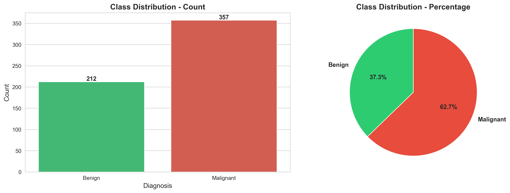

Hình 2.1 cho thấy tập Wisconsin không cân bằng tuyệt đối nhưng vẫn ở mức có thể xử lý tốt bằng các kỹ thuật học máy cổ điển khi kết hợp stratified split và class balancing. Đây là cơ sở để nhóm nghiên cứu ưu tiên `Sensitivity` trong quá trình tuning thay vì chỉ tối ưu accuracy.

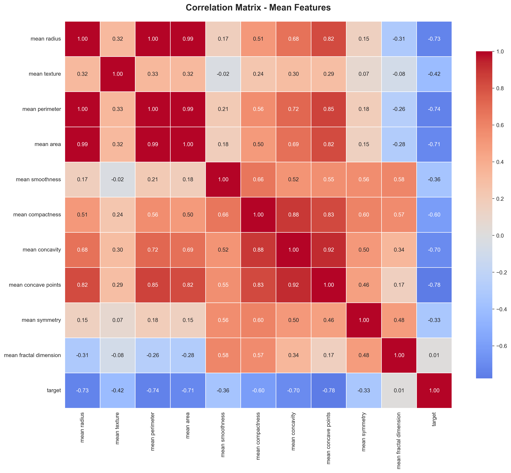

Hình 2.2 cho thấy nhiều đặc trưng hình thái tế bào có tương quan mạnh theo cụm, ví dụ các nhóm `radius`, `perimeter`, `area` và `concavity`. Quan sát này lý giải vì sao trong giai đoạn sau đề tài tiếp tục kiểm tra thêm feature selection, RFE và PCA để tránh dư thừa đặc trưng.

#### 2.2.2 Tiền xử lý dữ liệu
**Đối với dữ liệu WDBC:**
- Tách train/validation/test theo chiến lược stratified split
- Chuẩn hóa dữ liệu bằng `StandardScaler`
- Xử lý mất cân bằng lớp bằng `SMOTE` trong notebook preprocessing
- Trên nhánh artifact triển khai, script `train_ml_calibrated.py` dùng `CalibratedClassifierCV` với `cv=5` để hiệu chỉnh xác suất dự đoán

**Đối với dữ liệu CBIS-DDSM:**
- Tách ROI vùng mô vú bằng hàm `extract_roi_breast()`
- Dùng ngưỡng `threshold_value = 10` và biên `margin = 20`
- Resize ảnh về kích thước phù hợp với mô hình, phổ biến là `192x192` hoặc `224x224`
- Tăng cường dữ liệu bằng TTA và biến đổi ảnh ngẫu nhiên
- Áp dụng `class_weight` và `BinaryFocalCrossentropy` để xử lý mất cân bằng

Ví dụ hàm ROI preprocessing:

```python
roi_image, bbox = extract_roi_breast(
    image,
    threshold_value=10,
    margin=20
)
```

Đối với nhánh ML, sau bước chia train/validation/test theo stratified split, phân bố nhãn giữa các tập được giữ ổn định như Hình 2.3. Điều này giúp việc so sánh mô hình công bằng hơn và giảm nguy cơ lệch kết quả do sampling.

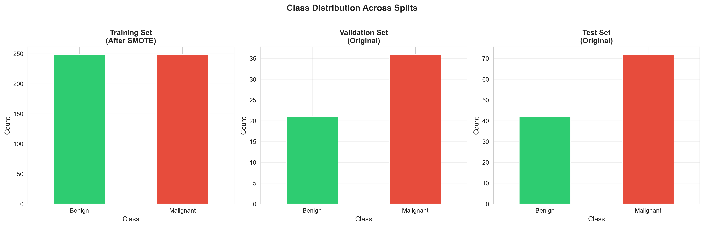

#### 2.2.3 Gán nhãn
Để thống nhất đầu ra toàn hệ thống, đề tài chuẩn hóa nhãn như sau:
- `Benign = 0`
- `Malignant = 1`

Lưu ý rằng bộ Wisconsin gốc trong `sklearn` dùng quy ước `target = 0` cho malignant và `target = 1` cho benign. Vì vậy, trong phần triển khai backend, hệ thống có bước quy đổi nhãn để toàn bộ API và giao diện cùng dùng chuẩn `0 = Benign`, `1 = Malignant`.

### 2.3 Phát triển mô hình phân loại Machine Learning

#### 2.3.1 Kiến trúc mô hình
Ba mô hình ML chính được nghiên cứu trong đề tài là:
- **Logistic Regression**
- **Random Forest**
- **XGBoost**

Mô-đun nghiên cứu `src/models/wisconsin_models.py` triển khai như sau:

```python
lr_model = LogisticRegression(
    random_state=42,
    max_iter=1000,
    class_weight='balanced'
)

rf_model = RandomForestClassifier(
    n_estimators=200,
    max_depth=20,
    random_state=42,
    class_weight='balanced'
)

xgb_model = XGBClassifier(
    max_depth=5,
    learning_rate=0.1,
    n_estimators=200,
    random_state=42,
    eval_metric='logloss'
)
```

Trong giai đoạn nghiên cứu học thuật, XGBoost được giữ lại để so sánh chuyên sâu. Tuy nhiên, trong artifact đang được web sử dụng, API hiện nạp ổn định hai mô hình chính là **Logistic Regression** và **Random Forest**.

#### 2.3.2 Thông số huấn luyện
Trong nhánh notebook nghiên cứu:
- Tối ưu siêu tham số bằng `GridSearchCV`
- Tiêu chí ưu tiên là `Recall/Sensitivity` nhằm hạn chế bỏ sót ca bệnh ác tính
- Thực hiện cross-validation và xuất biểu đồ ROC, PR, confusion matrix

Trong nhánh triển khai artifact hiện tại:

```python
models = {
    "Logistic Regression": CalibratedClassifierCV(lr_base, method="sigmoid", cv=5),
    "Random Forest": CalibratedClassifierCV(rf_base, method="sigmoid", cv=5),
}
```

Các tham số nổi bật:
- Logistic Regression: `max_iter=5000`, `solver='liblinear'`, `class_weight='balanced'`
- Random Forest: `n_estimators=600`, `min_samples_leaf=2`, `class_weight='balanced_subsample'`
- Calibration: `sigmoid`, `cv=5`

Kết quả retrain gần nhất ngày **04/04/2026**:

| Mô hình | ROC-AUC retrain |
|---|---:|
| Logistic Regression | 0.9967 |
| Random Forest | 0.9980 |

Song song với bảng số liệu, nhóm nghiên cứu còn xuất các hình đánh giá trực quan để kiểm tra hành vi mô hình dưới nhiều góc nhìn khác nhau. Các hình này đặc biệt quan trọng trong bối cảnh sàng lọc y khoa, nơi chỉ số tốt trên một bảng tổng hợp chưa đủ để kết luận mô hình đáng tin cậy.

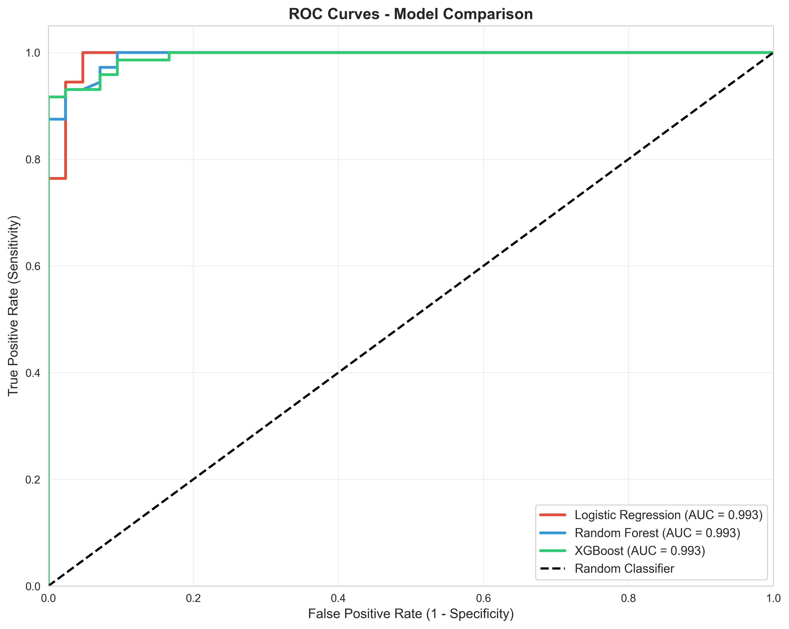

ROC curve cho thấy cả ba mô hình ML đều đạt vùng diện tích rất cao, trong đó Logistic Regression và Random Forest bám sát góc trái-trên của đồ thị. Điều này phù hợp với các giá trị ROC-AUC gần `0.99` ở bảng kết quả.

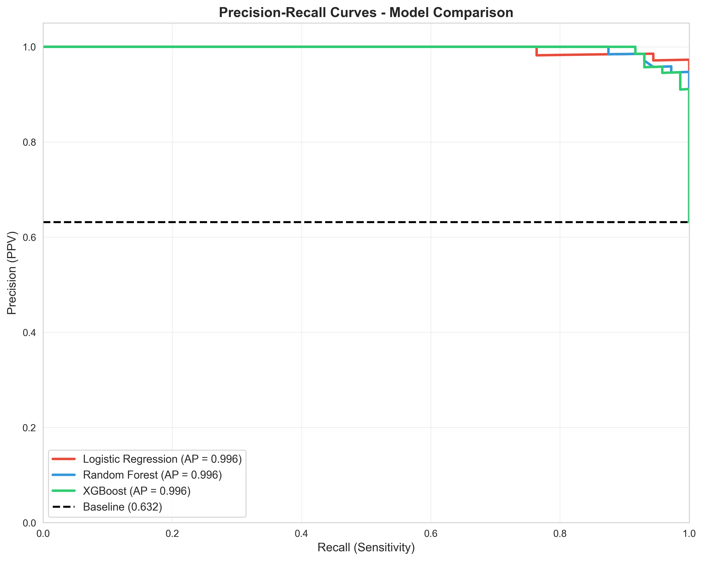

Precision-Recall curve có ý nghĩa hơn trong bối cảnh mất cân bằng lớp và ưu tiên phát hiện ca ác tính. Hình 2.5 cho thấy các mô hình vẫn duy trì độ chính xác dự đoán tích cực tốt khi tăng recall, từ đó hỗ trợ lựa chọn ngưỡng theo mục tiêu lâm sàng.

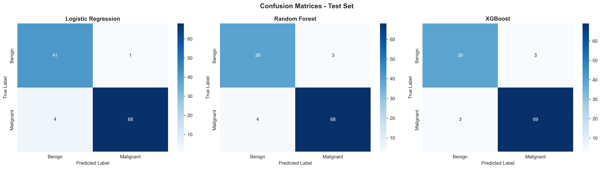

Confusion matrix là bằng chứng trực quan cho việc số lượng false negative của các mô hình ML được kiểm soát tương đối thấp. Đây là điểm mạnh quan trọng của nhánh ML trong đề tài.

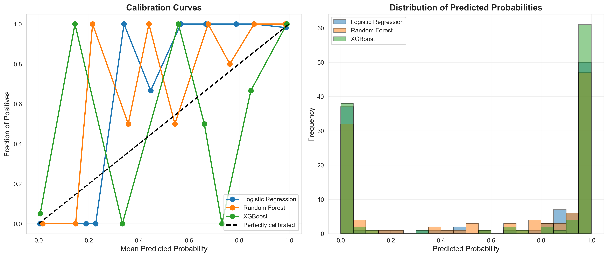

Hình 2.7 cho thấy lý do đề tài không chỉ lưu mô hình dự đoán mà còn thực hiện calibration. Với các hệ hỗ trợ quyết định y khoa, xác suất cần được diễn giải tương đối sát thực tế để bác sĩ và người dùng hiểu đúng mức độ nguy cơ.

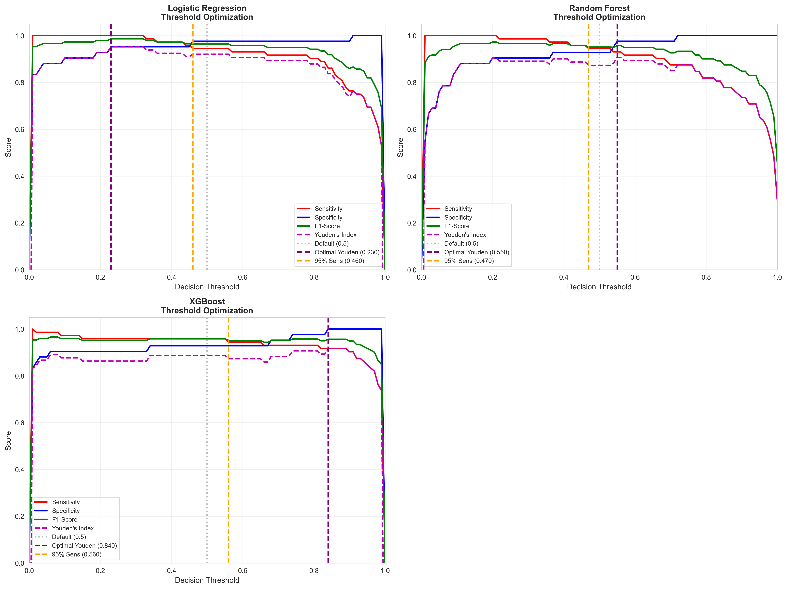

Ngưỡng quyết định không được cố định một cách máy móc. Nhóm nghiên cứu đã thử tối ưu threshold để cân bằng giữa `Sensitivity` và `Specificity`, qua đó phục vụ mục tiêu hạn chế bỏ sót ca ác tính trong thực tế.

#### 2.3.3 Lưu mô hình
Các mô hình sau huấn luyện được lưu dưới dạng `.pkl` hoặc `.joblib` để tích hợp trực tiếp vào backend:
- `models/wisconsin_logistic_regression_20260404_retrained.pkl`
- `models/wisconsin_random_forest_20260404_retrained.pkl`
- Báo cáo tổng hợp lưu tại `models/ml_retrain_report_20260404.json`

Việc lưu riêng artifact và report giúp quá trình triển khai, kiểm chứng và nâng cấp mô hình về sau được rõ ràng hơn.

### 2.4 Phát triển mô hình Deep Learning cho ảnh nhũ ảnh

#### 2.4.1 Giới thiệu EfficientNet/ResNet và Custom CNN
Trong nhánh nghiên cứu ảnh, đề tài sử dụng ba hướng kiến trúc chính:
- **ResNet50**: mô hình transfer learning mạnh, phù hợp với dữ liệu ảnh lớn
- **EfficientNet-B0**: kiến trúc gọn hơn, tối ưu tương quan giữa hiệu năng và chi phí tính toán
- **Custom CNN**: mô hình CNN tự xây dựng, đang được triển khai trong hệ thống web

Phần nghiên cứu PyTorch trong `src/models/deep_learning_models.py` hỗ trợ tạo `ResNet50`, `ResNet18` và `EfficientNet-B0`. Trong khi đó, nhánh triển khai thực tế trên backend dùng các artifact `.keras`, trong đó **Custom CNN** đang là mô hình active của website.

#### 2.4.2 Huấn luyện mô hình
Script huấn luyện chính đang dùng cho artifact triển khai là `scripts/train_dl_finetune_calibrated.py`. Quy trình này bao gồm:
- nạp dữ liệu từ `data/cbis_ddsm/processed/images`
- xây dựng mô hình theo kiến trúc lựa chọn
- dùng `BinaryFocalCrossentropy(gamma=2.0, alpha=0.25)`
- tối ưu bằng `Adam`
- áp dụng `EarlyStopping`, `ReduceLROnPlateau`, `ModelCheckpoint`
- tìm ngưỡng phân loại tốt nhất theo `balanced accuracy`
- đánh giá trên tập test bằng `TTA`
- xuất `calibration_profile.json` cho backend suy luận

Ví dụ phần compile mô hình:

```python
loss_fn = tf.keras.losses.BinaryFocalCrossentropy(gamma=2.0, alpha=0.25)
model.compile(
    optimizer=tf.keras.optimizers.Adam(learning_rate=1e-4),
    loss=loss_fn,
    metrics=[
        tf.keras.metrics.BinaryAccuracy(name="accuracy"),
        tf.keras.metrics.AUC(name="auc"),
        tf.keras.metrics.Precision(name="precision"),
        tf.keras.metrics.Recall(name="recall"),
    ],
)
```

**Kết quả nghiên cứu giai đoạn 2 trên nhánh DL**

| Mô hình | Accuracy | Sensitivity | Specificity | ROC-AUC |
|---|---:|---:|---:|---:|
| EfficientNet-B0 | 0.419689 | 1.000000 | 0.000000 | 0.500000 |
| ResNet50 | 0.458549 | 0.956790 | 0.098214 | 0.546737 |
| Custom CNN | 0.476684 | 0.956790 | 0.129464 | 0.604608 |
| Custom CNN v2 | 0.505181 | 0.950617 | 0.183036 | 0.583636 |

**Artifact DL đang triển khai trên web**

Theo `custom_cnn_finetuned_calibrated_refresh_summary.json`:
- Epochs: `18`
- Batch size: `12`
- Image size: `192`
- Threshold: `0.49`
- Validation accuracy: `0.5796`
- Validation AUC: `0.6288`
- Test TTA accuracy: `0.5933`
- Test TTA AUC: `0.6544`

Như vậy, so với benchmark nghiên cứu ban đầu, artifact Custom CNN calibrate dùng cho web đã cải thiện đáng kể tính ổn định khi suy luận.

#### 2.4.3 Dự đoán và sinh ảnh giải thích bằng Grad-CAM
Khi người dùng tải ảnh nhũ ảnh, backend:
1. đọc ảnh và resize về kích thước phù hợp,
2. gọi mô hình DL để lấy xác suất ác tính,
3. hậu xử lý xác suất theo calibration profile,
4. nếu bật `include_explanation`, hệ thống sinh heatmap Grad-CAM và lưu ảnh vào `frontend/results/`.

Đoạn lõi khi sinh Grad-CAM:

```python
heatmap, regions = self.get_gradcam(
    explain_model,
    explain_input_tensor,
    explain_model_name,
    target_size=explain_target_size,
)
```

Ảnh giải thích được overlay lên ảnh gốc và trả về đường dẫn tĩnh dạng `/results/<filename>.png`, giúp frontend có thể hiển thị trực tiếp cho người dùng.

### 2.5 Giải thích mô hình với SHAP

#### 2.5.1 Giới thiệu SHAP
SHAP là phương pháp giải thích dựa trên giá trị Shapley trong lý thuyết trò chơi, cho phép đo lường mức đóng góp của từng đặc trưng vào kết quả dự đoán. Trong đề tài này, SHAP là công cụ trọng tâm để giải thích các mô hình ML trên dữ liệu lâm sàng.

Ưu điểm của SHAP:
- định lượng được tác động dương/âm của từng chỉ số,
- so sánh được mức ảnh hưởng tương đối giữa các mô hình,
- phù hợp với dữ liệu tabular có ý nghĩa lâm sàng rõ ràng.

#### 2.5.2 Triển khai
Module `src/explainability/shap_explainer.py` hỗ trợ:
- `plot_summary()`
- `plot_bar()`
- `plot_waterfall()`
- `get_feature_importance()`
- `compare_shap_across_models()`

Theo file `shap_feature_importance_xgboost.csv`, các đặc trưng ảnh hưởng mạnh nhất tới dự đoán ác tính ở mô hình XGBoost gồm:
1. `worst perimeter`
2. `worst area`
3. `worst concave points`
4. `worst texture`
5. `area error`

Điều này cho thấy hệ thống đang học đúng các đặc trưng hình thái tế bào quan trọng như kích thước cực đại, độ lõm và mức độ không đều của tổn thương.

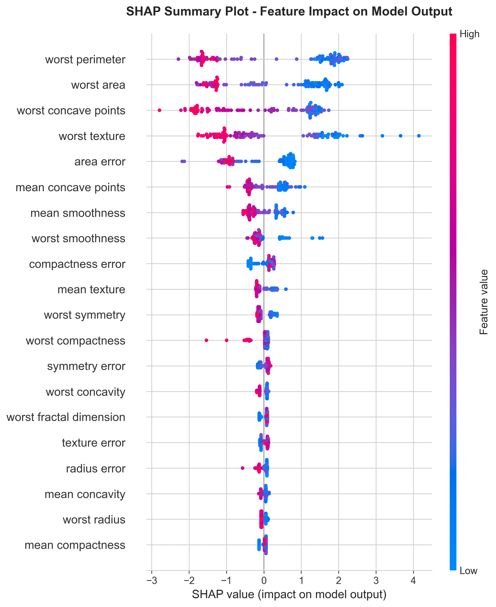

SHAP summary plot cho thấy không chỉ đặc trưng nào quan trọng, mà còn thể hiện giá trị cao/thấp của mỗi đặc trưng đẩy xác suất ác tính theo hướng nào. Đây là lớp giải thích rất phù hợp để diễn giải cho từng chỉ số lâm sàng.

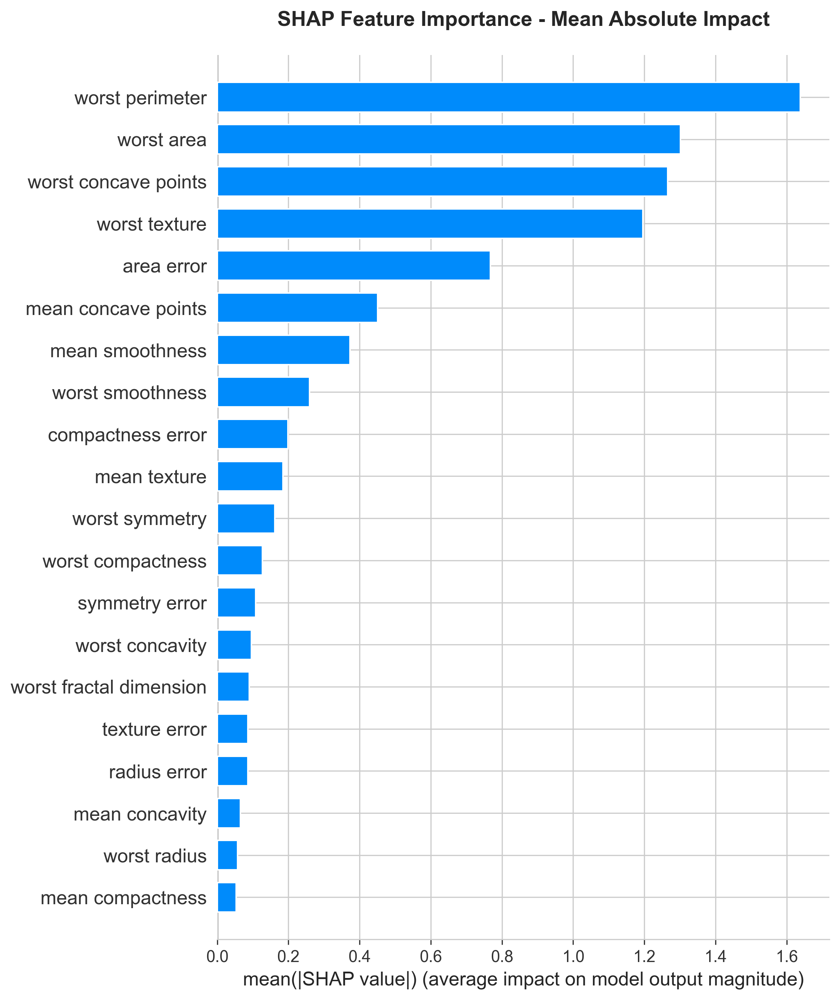

Biểu đồ bar củng cố nhận định rằng các đặc trưng thuộc nhóm `worst` và `error` mang tính phân biệt mạnh nhất. Kết quả này nhất quán với trực giác y học về mức độ bất thường hình thái tế bào.

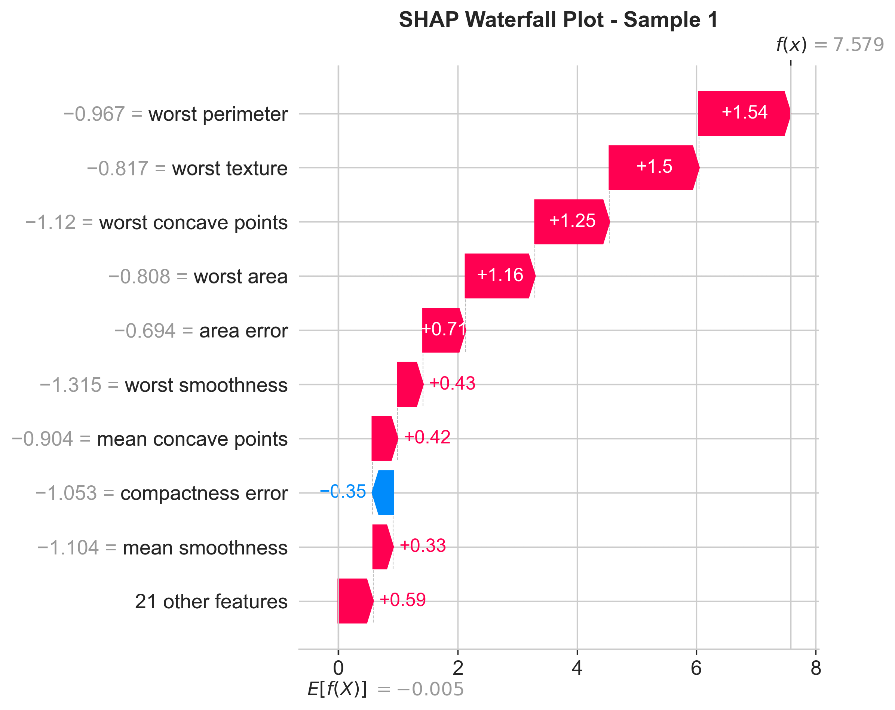

Waterfall plot cho phép đi sâu tới từng ca bệnh cụ thể. Nhờ đó, hệ thống có thể giải thích vì sao một bệnh nhân bị đẩy lên xác suất ác tính cao thay vì chỉ đưa ra xác suất tổng quát.

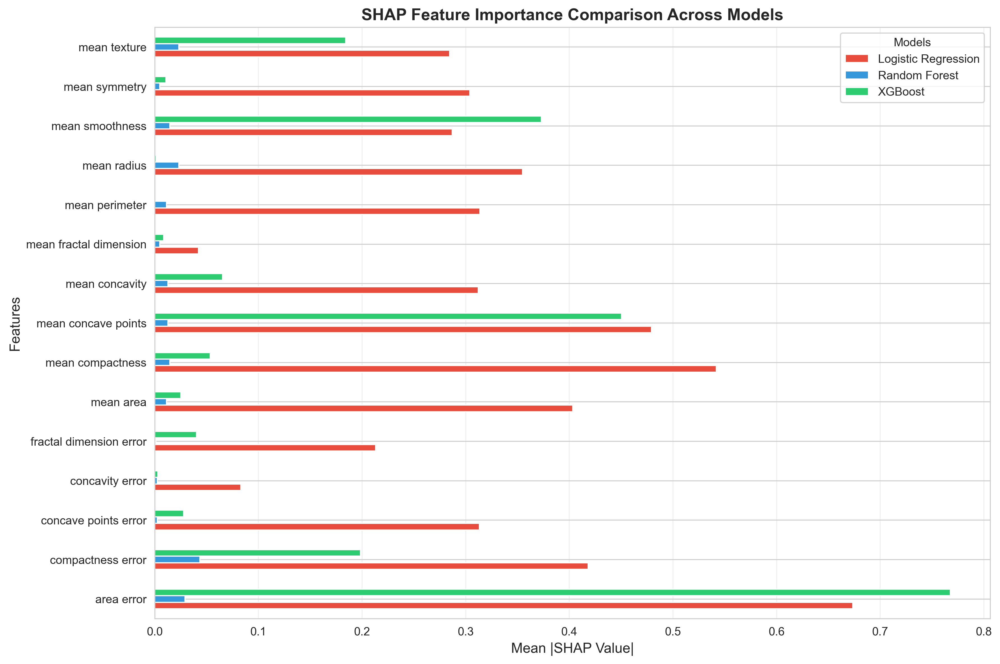

Việc so sánh SHAP giữa nhiều mô hình giúp kiểm tra tính ổn định của tri thức mà mô hình học được. Nếu các mô hình mạnh cùng nhấn vào những đặc trưng tương tự, độ tin cậy của kết luận sẽ cao hơn.

### 2.6 Chatbot tư vấn y khoa bằng Gemini API

#### 2.6.1 Giới thiệu
Ngoài phần dự đoán, hệ thống còn tích hợp một lớp trợ lý ảo để:
- giải thích kết quả theo ngôn ngữ tự nhiên,
- trả lời câu hỏi phổ thông về ung thư vú,
- gợi ý bước tiếp theo mang tính hỗ trợ sau sàng lọc.

#### 2.6.2 Triển khai
Mô-đun `backend/app/services/ai_advisor.py` triển khai cơ chế ưu tiên:

1. **OCR local (Tesseract/EasyOCR) + regex mapping 30 chỉ số**
2. **Gemini/OpenAI vision fallback khi OCR local chưa đủ**
3. **Local rule-based fallback cho AI Advisor/chatbot**

Luồng này áp dụng cho:
- AI Advisor sinh lời khuyên sau dự đoán,
- chatbot hỏi đáp y khoa,
- trích xuất chỉ số lâm sàng từ ảnh phiếu xét nghiệm.

Điều này giúp hệ thống vẫn vận hành được ngay cả khi nhà cung cấp LLM bên ngoài bị lỗi hoặc hết quota; đồng thời giảm phụ thuộc mạng cho chức năng đọc phiếu xét nghiệm.

### 2.7 Pipeline hệ thống dự đoán đa phương thức
Pipeline của hệ thống được tổ chức theo luồng:

**Nhánh ML**
- Người dùng nhập 30 đặc trưng lâm sàng
- Backend kiểm tra dữ liệu bằng Pydantic schema
- Gọi `prediction_service.predict()`
- Trả về xác suất, nhãn, risk band, top features và lời khuyên

**Nhánh DL**
- Người dùng tải ảnh nhũ ảnh
- Backend đọc ảnh, tiền xử lý, chạy `dl_prediction_service.predict()`
- Nếu cần, sinh ảnh Grad-CAM
- Trả về xác suất, nhãn, risk band và lời khuyên

**Nhánh Multimodal**
- Nhận đồng thời `clinical_data` và `image_file`
- Chạy ML và DL độc lập
- Kết hợp xác suất:

```python
combined_p = (p_ml * 0.4) + (p_dl * 0.6)
```

- Phân lớp theo ngưỡng `0.5`
- Gọi `ai_advisor_service.advice_for_multimodal()`
- Nếu người dùng đã đăng nhập, toàn bộ kết quả được lưu vào lịch sử dự đoán

### 2.8 Đánh giá hệ thống và phân tích lỗi

#### 2.8.1 Ưu điểm
**Đối với nhánh ML**

Kết quả trên tập test độc lập từ `wisconsin_test_results.csv`:

| Mô hình | Accuracy | Sensitivity | Specificity | ROC-AUC |
|---|---:|---:|---:|---:|
| Logistic Regression | 0.9561 | 0.9444 | 0.9762 | 0.9931 |
| Random Forest | 0.9386 | 0.9444 | 0.9286 | 0.9932 |
| XGBoost | 0.9474 | 0.9583 | 0.9286 | 0.9927 |

Kết quả cross-validation từ `cross_validation_summary.csv`:

| Mô hình | Accuracy CV | Recall CV | ROC-AUC CV |
|---|---:|---:|---:|
| Logistic Regression | 0.9784 ± 0.0157 | 0.9860 ± 0.0172 | 0.9942 ± 0.0074 |
| Random Forest | 0.9712 ± 0.0144 | 0.9684 ± 0.0233 | 0.9937 ± 0.0052 |
| XGBoost | 0.9766 ± 0.0122 | 0.9789 ± 0.0131 | 0.9929 ± 0.0119 |

Những con số này cho thấy nhánh ML rất mạnh trên dữ liệu lâm sàng, đặc biệt về `Sensitivity` và `ROC-AUC`.

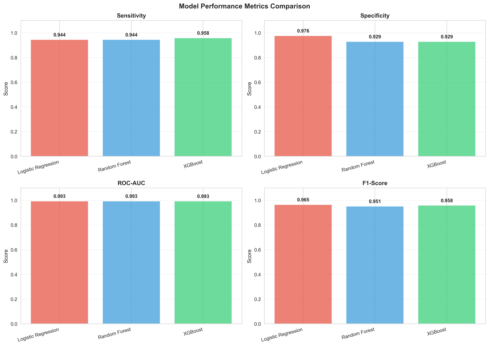

Biểu đồ tổng hợp chỉ số giúp nhìn nhanh tương quan giữa accuracy, recall, precision và F1-score thay vì đọc rời từng con số. Đây là một trong những biểu đồ trung tâm của phần comparative study.

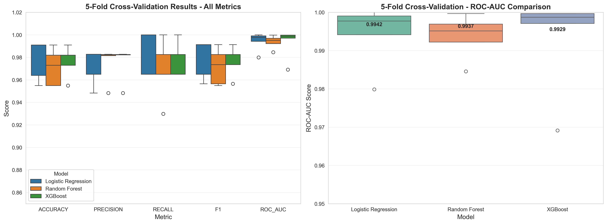

Hình 2.14 cho thấy các mô hình ML không chỉ mạnh ở một lần chia dữ liệu duy nhất mà còn giữ được hiệu năng ổn định qua nhiều fold. Điều này làm tăng độ tin cậy học thuật của kết quả.

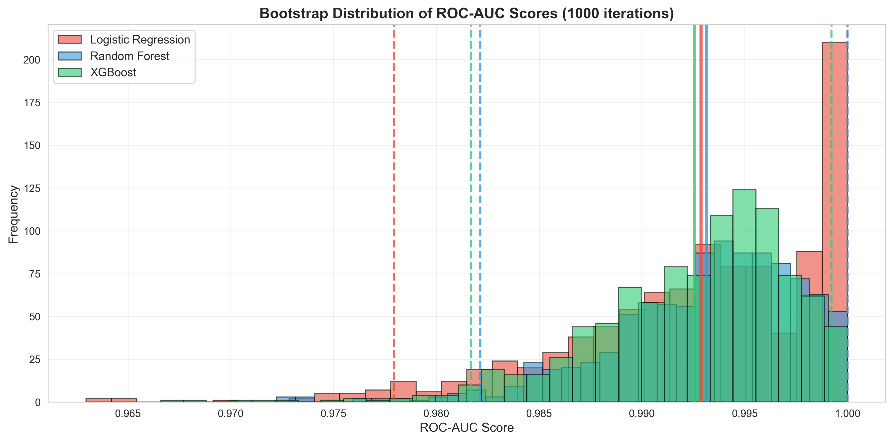

Bootstrap ROC-AUC distribution là bước kiểm định bổ sung để tránh báo cáo quá lạc quan từ một test split duy nhất. Việc thêm bootstrap cho thấy đề tài đã quan tâm tới tính bền vững của kết luận thực nghiệm.

**Đối với nhánh DL**
- Mô hình Custom CNN calibrate hiện tại đã đạt `test_tta_auc = 0.6544`, tốt hơn mặt bằng benchmark ban đầu.
- Hệ thống đã tích hợp được cơ chế threshold calibration, Grad-CAM và selection/promotion artifact.
- Có thêm baseline ảnh bằng `ImageRF` để tham chiếu, dù chưa đạt hiệu quả tốt.

**Về tính giải thích và khả năng triển khai**
- Hệ thống có SHAP cho ML và Grad-CAM cho DL.
- Có đầy đủ backend, frontend, auth, patient workspace, history, chatbot, AI Advisor, Docker Compose.
- Đây là một hệ thống nghiên cứu đã đi qua ngưỡng “mô hình đơn lẻ” để trở thành một sản phẩm demo đầu-cuối.

#### 2.8.2 Nhược điểm
Mặc dù nhánh ML đạt kết quả rất tốt, đề tài vẫn còn một số hạn chế:

- Nhánh DL còn **độ đặc hiệu thấp** trong các benchmark nghiên cứu ban đầu. `phase2_summary.json` cho thấy mô hình tốt nhất của giai đoạn ROI-tuning chỉ đạt `specificity = 0.1830`.
- `phase2_summary.json` cũng ghi nhận:
  - tỷ lệ phát hiện ung thư: `95.1%`
  - tỷ lệ bỏ sót ca ung thư: `4.9%`
  - số ca ung thư bị bỏ sót: `8`
  - số ca cần kiểm tra thêm: `193`
- Error analysis trên nhánh ML cho thấy vẫn còn false negatives:
  - Logistic Regression: `4` FN
  - Random Forest: `4` FN
  - XGBoost: `3` FN
- Hệ thống web hiện dùng SQLite; phù hợp cho demo nhưng chưa đủ cho production nhiều người dùng.
- Endpoint thống kê nghiên cứu nâng cao đã có thiết kế nhưng phụ thuộc vào bước xuất JSON thống kê từ notebook.

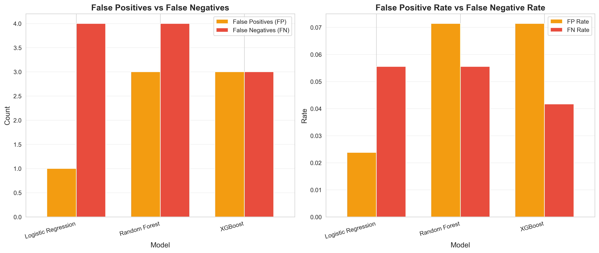

Hình 2.16 nhấn mạnh rằng dù kết quả tổng thể cao, các lỗi bỏ sót ca ác tính vẫn tồn tại và cần được xem như rủi ro quan trọng nhất của hệ thống. Chính vì vậy, đề tài ưu tiên hướng tối ưu tiếp theo vào calibration, thresholding và multimodal fusion thay vì chỉ tăng accuracy danh nghĩa.

### 2.9 Tổng kết chương
Chương này đã trình bày toàn bộ nền tảng mô hình của đề tài: dữ liệu, tiền xử lý, ML, DL, XAI, chatbot và pipeline đa phương thức. Có thể khẳng định rằng các artifact cốt lõi của hệ thống đã sẵn sàng để tích hợp vào web và phục vụ các thử nghiệm thực tế ở chương tiếp theo.

---

## CHƯƠNG III: TRIỂN KHAI VÀ THỬ NGHIỆM HỆ THỐNG WEB

### 3.1 Mục tiêu chương
Chương này trình bày quy trình đưa các mô hình nghiên cứu vào môi trường ứng dụng thực tế dưới dạng hệ thống web. Nội dung gồm thiết lập môi trường, khởi tạo thư viện, tiếp nhận dữ liệu người dùng, sinh kết quả dự đoán, điều khiển giao diện và đo lường hiệu năng hệ thống.

### 3.2 Thiết lập môi trường triển khai
Để triển khai hệ thống BreastCare Mint, các công cụ và thư viện chính bao gồm:

- Python 3.9+
- FastAPI, Uvicorn
- Pydantic
- scikit-learn, XGBoost
- TensorFlow/Keras
- Pillow, OpenCV
- EasyOCR, Tesseract (pytesseract)
- SQLite
- Docker, Docker Compose
- Gemini API hoặc OpenAI API cho AI Advisor

Môi trường cài đặt được thiết lập thông qua `requirements.txt`:

```bash
python -m venv venv
source venv/bin/activate
pip install -r requirements.txt
```

Các file triển khai chính:
- `backend/app/main.py`
- `backend/app/api/endpoints.py`
- `backend/app/services/prediction.py`
- `backend/app/services/prediction_dl.py`
- `backend/app/services/ai_advisor.py`
- `frontend/app.js`
- `docker-compose.yml`

Lưu ý: Mục lục ban đầu dự kiến dùng `SQLAlchemy`, tuy nhiên phiên bản triển khai hiện tại của đề tài sử dụng trực tiếp `SQLite` qua module `sqlite3` để giảm phụ thuộc và phù hợp với giai đoạn demo nghiên cứu.

#### 3.2.1 Khởi tạo mô hình và thư viện
Backend được khởi tạo bằng FastAPI, cấu hình CORS và mount thư mục kết quả:

```python
app = FastAPI(
    title="Breast Cancer AI Prediction API",
    description="API for classifying breast cancer as Benign or Malignant using ML/DL models.",
    version="1.0.0"
)

app.add_middleware(
    CORSMiddleware,
    allow_origins=["*"],
    allow_credentials=True,
    allow_methods=["*"],
    allow_headers=["*"],
)

app.include_router(endpoints.router, prefix="/api/v1")
```

Khi hệ thống khởi động:
- database được init,
- model DL có thể preload tùy biến qua biến môi trường `DL_PRELOAD_ON_STARTUP`,
- thư mục `frontend/results/` được mount để lưu ảnh Grad-CAM.

Tại thời điểm kiểm tra cục bộ ngày **08/04/2026**, endpoint trạng thái DL cho biết:
- `available_models`: `["Custom CNN"]`
- `loaded_models`: `["Custom CNN", "EfficientNet-B0", "ImageRF", "ResNet50"]`
- `active_model`: `Custom CNN`

#### 3.2.2 Quá trình tiếp nhận dữ liệu từ người dùng
Hệ thống tiếp nhận ba loại dữ liệu đầu vào:

**a. Dữ liệu lâm sàng**
- Người dùng nhập 30 đặc trưng tế bào học qua form frontend
- Backend nhận dữ liệu qua endpoint `/api/v1/predict/`

**b. Ảnh nhũ ảnh**
- Người dùng upload ảnh qua tab DL
- Backend nhận file qua endpoint `/api/v1/predict/image/`

**c. Dự đoán đa phương thức**
- Người dùng gửi đồng thời dữ liệu lâm sàng và ảnh
- Backend xử lý qua `/api/v1/predict/multimodal/`

Ngoài ra, nếu người dùng có ảnh phiếu xét nghiệm lâm sàng, hệ thống còn hỗ trợ:
- endpoint `/api/v1/predict/extract-clinical/`
- trích xuất tự động các trường cần điền vào form theo pipeline hybrid:
  - OCR local (Tesseract/EasyOCR),
  - regex + mapping 30 đặc trưng,
  - fallback Gemini/OpenAI nếu OCR local chưa đủ.

Một đoạn mã tiêu biểu của luồng multimodal:

```python
request = PredictionRequest(**data_json)
ml_res = prediction_service.predict(request, model_name=ml_model)

image_bytes = await image_file.read()
dl_res = dl_prediction_service.predict(
    image_bytes,
    model_name=dl_model,
    include_explanation=include_explanation,
)
```

Để thuận tiện cho việc kiểm thử và trình diễn, frontend đã chuẩn bị sẵn hai ảnh nhũ ảnh mẫu đại diện cho hai tình huống lành tính và ác tính. Đây cũng chính là hai ảnh được dùng để đo thời gian phản hồi và sinh ảnh giải thích trong phần thử nghiệm thực tế.

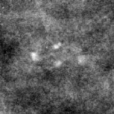

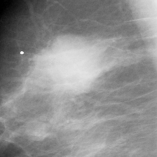

#### 3.2.3 Nhận diện kết quả và AI Advisor
Sau khi mô hình trả kết quả, hệ thống sẽ sinh thêm phần tư vấn ngôn ngữ tự nhiên:
- `advice_for_single()` cho nhánh ML hoặc DL
- `advice_for_multimodal()` cho nhánh kết hợp
- `chat_about_breast_cancer()` cho chatbot hỏi đáp

Mỗi response có thể bao gồm:
- `diagnosis`
- `probability`
- `raw_probability`
- `risk_band`
- `analysis_text`
- `advice`
- `advice_provider`
- `top_features` hoặc `explanation_image`

Đây là điểm khác biệt quan trọng của hệ thống: đầu ra không chỉ là nhãn, mà là một gói thông tin phục vụ giải thích và định hướng tiếp theo.

#### 3.2.4 Hiển thị kết quả và điều khiển
Frontend được xây dựng bằng HTML/CSS/JavaScript thuần, hỗ trợ:
- Trang chủ giới thiệu hệ thống
- Trang kiến thức
- Trang chăm sóc và dinh dưỡng
- Trang video
- Trang hỏi AI
- Trang dự đoán
- Trang thống kê mô hình
- Trang giới thiệu dự án
- Trang lịch sử dự đoán
- Khu quản lý bệnh nhân cho vai trò bác sĩ

Các thành phần điều khiển chính:
- chọn mô hình ML hoặc DL
- nạp dữ liệu mẫu benign/malignant
- upload ảnh demo
- hiển thị risk band, top features, benchmark
- xem lại lịch sử dự đoán đã lưu

### 3.3 Mô hình phân quyền hệ thống (RBAC)
Trong phiên bản web hiện tại, hệ thống đã triển khai tách vai trò `bác sĩ` và `người dùng` ở mức ứng dụng để bảo đảm quyền truy cập dữ liệu bệnh nhân đúng phạm vi.

**Vai trò người dùng thông thường (`user`)**
- Thực hiện dự đoán ML, DL và multimodal.
- Sử dụng chatbot và AI Advisor.
- Xem lịch sử dự đoán của chính tài khoản.
- Không có quyền truy cập khu quản lý bệnh nhân của bác sĩ.

**Vai trò bác sĩ (`doctor`)**
- Có toàn bộ quyền của người dùng thông thường.
- Được truy cập khu quản lý bệnh nhân và không gian làm việc theo từng bệnh nhân.
- Được tạo/cập nhật hồ sơ bệnh nhân và xem lịch sử dự đoán theo bệnh nhân phụ trách.
- Các endpoint nhạy cảm được kiểm tra quyền bằng lớp bảo vệ nghiệp vụ phía backend trước khi truy vấn dữ liệu.

**Cơ chế kiểm soát truy cập**
- Xác thực người dùng qua đăng nhập và session/token.
- Ràng buộc truy cập dữ liệu theo `user_id` và `patient_id` nhằm tránh lộ dữ liệu chéo.
- Các thao tác dành riêng cho bác sĩ được kiểm tra qua guard `require_doctor` trước khi thực thi.
- Toàn bộ lịch sử dự đoán và lịch sử hội thoại được lưu có gắn định danh người dùng để truy vết.

### Kết quả thử nghiệm và đo lường
Việc thử nghiệm được thực hiện trên môi trường cục bộ ngày **08/04/2026** với backend đang chạy tại `127.0.0.1:8000`. Các phép đo dưới đây phản ánh **thời gian phản hồi end-to-end của API**, tức là bao gồm suy luận mô hình, hậu xử lý và sinh phần tư vấn AI nếu có.

**1. Độ chính xác và khả năng nhận đúng**

Nhánh ML trên tập test độc lập:
- Logistic Regression: `Accuracy = 95.61%`, `Sensitivity = 94.44%`, `Specificity = 97.62%`, `ROC-AUC = 0.9931`
- Random Forest: `Accuracy = 93.86%`, `Sensitivity = 94.44%`, `Specificity = 92.86%`, `ROC-AUC = 0.9932`
- XGBoost: `Accuracy = 94.74%`, `Sensitivity = 95.83%`, `Specificity = 92.86%`, `ROC-AUC = 0.9927`

Nhánh DL đang triển khai:
- Custom CNN calibrate: `test_tta_accuracy = 59.33%`, `test_tta_auc = 0.6544`
- Trong benchmark ROI-tuning, mô hình tốt nhất đạt `Sensitivity = 95.06%`

**2. Thời gian phản hồi API**

| Endpoint | Kịch bản đo | Thời gian phản hồi |
|---|---|---:|
| `/api/v1/models/` | Lấy danh sách mô hình ML | 0.011676 s |
| `/api/v1/models/dl/status/` | Lấy trạng thái mô hình DL | 0.010806 s |
| `/api/v1/models/benchmarks/` | Lấy benchmark mô hình | 0.012861 s |
| `/api/v1/predict/` | Mẫu ác tính, Logistic Regression | 3.812804 s |
| `/api/v1/predict/` | Mẫu lành tính, Logistic Regression | 3.773303 s |
| `/api/v1/predict/image/` | Ảnh demo benign, Custom CNN | 4.408863 s |
| `/api/v1/predict/image/` | Ảnh demo malignant, Custom CNN | 7.483126 s |

Nhận xét:
- Các endpoint trạng thái rất nhanh, khoảng `11-13 ms`
- Endpoint suy luận ML và DL chậm hơn vì ngoài suy luận còn có bước sinh `analysis_text` và gọi AI Advisor
- Độ trễ DL cao hơn ML do phải đọc ảnh, resize, chạy CNN và hậu xử lý xác suất

**3. Tình huống nhận đúng/sai**
- Mẫu malignant chuẩn cho kết quả `diagnosis = Malignant`, `probability ≈ 88.26%` ở nhánh ML
- Mẫu benign chuẩn cho kết quả `diagnosis = Benign`, `probability ≈ 43.58%` ở nhánh ML
- Ảnh demo benign trên DL cho kết quả `diagnosis = Benign`, `probability ≈ 32.82%`
- Ảnh demo malignant trên DL cho kết quả `diagnosis = Malignant`, `probability ≈ 75.61%`

Điều này cho thấy hệ thống web đã vận hành được end-to-end và phản hồi đúng với các ca mẫu đại diện trong repo.

Đặc biệt, khi bật `include_explanation=True`, artifact Custom CNN đang triển khai còn sinh được ảnh Grad-CAM thực tế cho cả hai ảnh demo. Các hình dưới đây được tạo cục bộ ngày **08/04/2026** từ chính mô-đun `dl_prediction_service.predict()`, thể hiện vùng ảnh mà mô hình tập trung khi suy luận.


---

## CHƯƠNG IV: QUY TRÌNH HOÀN THIỆN SẢN PHẨM

### 4.1 Lên kế hoạch phát triển sản phẩm
**Mô tả:**  
Quá trình phát triển sản phẩm của đề tài được tổ chức theo hướng đi từ nghiên cứu notebook sang script tự động hóa và cuối cùng là web app triển khai được. Sản phẩm không chỉ là một mô hình dự đoán, mà là một nền tảng thử nghiệm nhiều thành phần: ML, DL, XAI, chatbot, auth, patient workspace và deploy.

**Các yêu cầu kỹ thuật:**
- Phát triển pipeline ML cho dữ liệu WDBC
- Phát triển pipeline DL cho ảnh nhũ ảnh CBIS-DDSM
- Tích hợp SHAP và Grad-CAM
- Xây dựng API FastAPI và frontend web
- Quản lý người dùng, bệnh nhân, lịch sử dự đoán
- Sinh lời khuyên tự động bằng LLM
- Đóng gói bằng Docker Compose và Nginx

**Kết quả của giai đoạn lập kế hoạch:**
- Xác định rõ luồng nghiên cứu: EDA → preprocessing → training → evaluation → explainability → deployment
- Tạo cấu trúc thư mục chuẩn hóa cho `data/`, `src/`, `models/`, `backend/`, `frontend/`, `scripts/`
- Định nghĩa chiến lược kiểm thử gồm smoke test API, kiểm thử suy luận và kiểm thử giao diện
- Chuẩn bị sẵn các script retrain, calibration, promote artifact và deploy

**Công cụ sử dụng**

| Thành phần | Công cụ |
|---|---|
| Ngôn ngữ chính | Python, JavaScript |
| ML tabular | scikit-learn, XGBoost |
| DL ảnh nhũ ảnh | TensorFlow/Keras, PyTorch |
| Explainable AI | SHAP, Grad-CAM |
| Backend | FastAPI, Pydantic, Uvicorn |
| Cơ sở dữ liệu | SQLite |
| Frontend | HTML, CSS, JavaScript |
| AI Advisor | OCR local (Tesseract/EasyOCR), Gemini/OpenAI fallback, local rule-based |
| Triển khai | Docker, Docker Compose, Nginx |

### 4.2 Phát triển sản phẩm

#### 4.2.1 Mô tả tổng quan
Hệ thống được xây dựng theo kiến trúc nhiều lớp:

1. **Frontend**
- giao diện tương tác với người dùng
- form nhập dữ liệu lâm sàng
- upload ảnh nhũ ảnh
- xem dashboard, lịch sử, bệnh nhân và chatbot

2. **Backend**
- xác thực, quản lý session
- xử lý API dự đoán
- điều phối AI Advisor
- lưu lịch sử dự đoán và hội thoại

3. **Models**
- ML models cho dữ liệu WDBC
- DL models cho ảnh CBIS-DDSM
- SHAP và Grad-CAM cho XAI

4. **Database**
- lưu users, sessions, password reset tokens, patients, predictions, chat_messages

Kiến trúc này cho phép tách bạch rõ ràng giữa nghiên cứu mô hình và triển khai sản phẩm.

#### 4.2.2 Quy trình huấn luyện và đánh giá ML (Wisconsin)
Quy trình nhánh ML trong đề tài được xây dựng khá hoàn chỉnh, bao gồm cả notebook nghiên cứu lẫn script artifact:

**Bước 1: EDA**
- phân bố lớp
- tương quan đặc trưng
- boxplot, histogram, pairplot
- phát hiện mất cân bằng dữ liệu

**Bước 2: Tiền xử lý**
- chuẩn hóa dữ liệu bằng `StandardScaler`
- tách tập theo stratified split
- dùng `SMOTE` trên tập train
- ngăn rò rỉ dữ liệu bằng cách fit scaler chỉ trên train

**Bước 3: Huấn luyện**
- Logistic Regression
- Random Forest
- XGBoost
- tuning bằng `GridSearchCV` với thước đo ưu tiên `Recall`

**Bước 4: Đánh giá**
- confusion matrix
- ROC curve, PR curve
- Sensitivity, Specificity, PPV, NPV
- error analysis
- cross-validation summary

**Bước 5: Hiệu chỉnh xác suất và xuất artifact**
- dùng `scripts/train_ml_calibrated.py`
- calibration bằng `CalibratedClassifierCV`
- xuất `.pkl` và JSON report

Kết quả thực nghiệm cho thấy nhánh ML là trụ cột mạnh nhất của đề tài về độ ổn định và khả năng giải thích.

Bên cạnh pipeline train/evaluate cơ bản, nhóm nghiên cứu còn mở rộng sang các notebook đánh giá độ học, chọn đặc trưng và phân tích không gian đặc trưng. Đây là phần rất có giá trị khi trình bày với giáo viên vì nó cho thấy đề tài không chỉ “chạy mô hình” mà còn thực sự nghiên cứu hành vi dữ liệu.

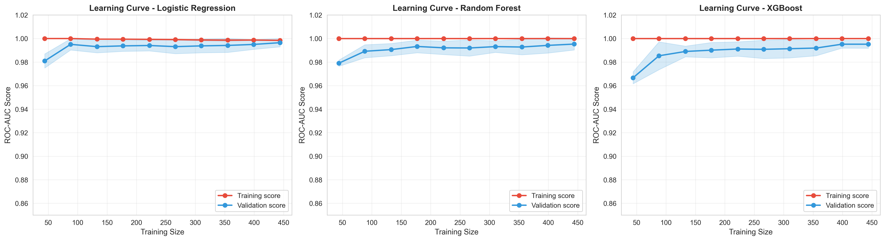

Learning curve cho phép kiểm tra mô hình đang bị overfitting hay underfitting, đồng thời hỗ trợ quyết định có nên tăng dữ liệu hoặc thay đổi độ phức tạp mô hình hay không.

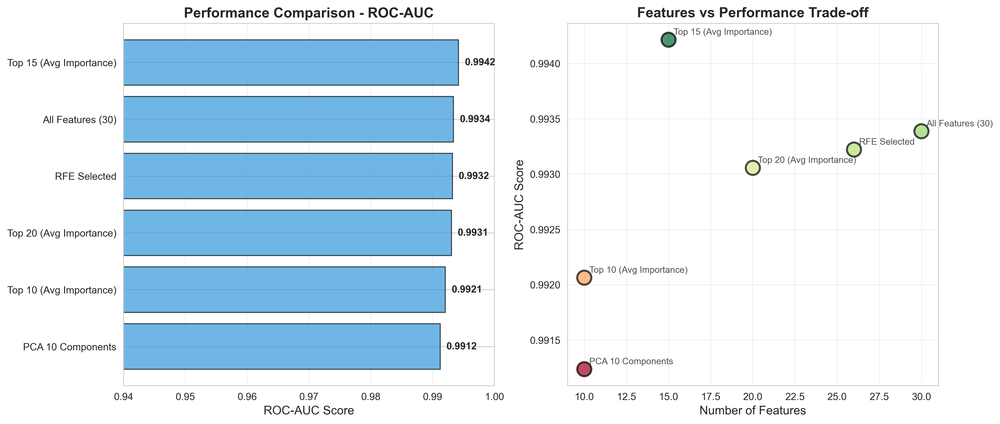

Hình 4.2 cho thấy nhóm nghiên cứu đã thử nhiều chiến lược feature selection thay vì chấp nhận toàn bộ 30 đặc trưng như dữ liệu đầu vào ban đầu.

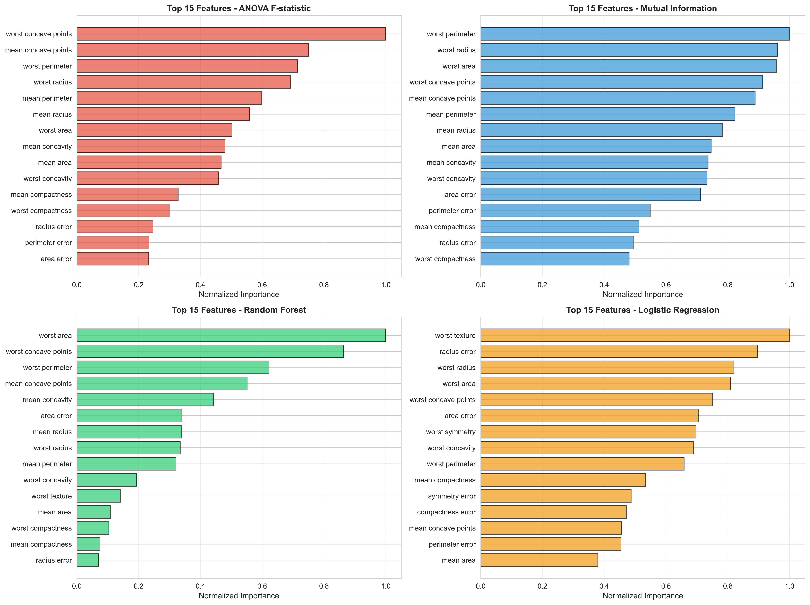

Biểu đồ này giúp đối chiếu kết quả giữa importance theo mô hình, SHAP và các phương pháp phân tích khác, từ đó củng cố độ tin cậy của các đặc trưng được xem là quan trọng.

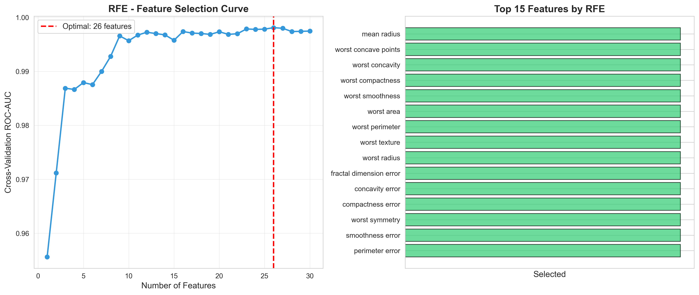

RFE được dùng để kiểm tra xem có thể rút gọn tập đặc trưng mà vẫn duy trì hiệu năng ở mức chấp nhận được hay không. Đây là bước quan trọng nếu muốn tối ưu hệ thống cho triển khai thật.

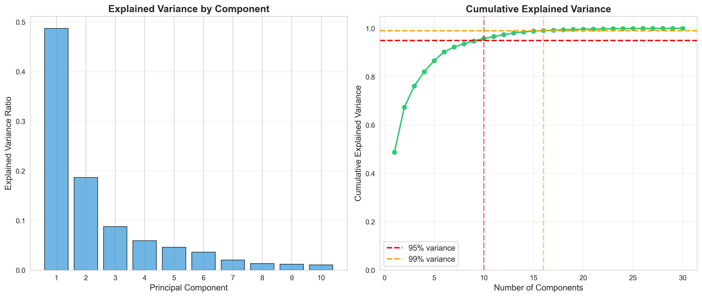

PCA cung cấp góc nhìn hình học về khả năng phân tách lớp trong không gian đặc trưng, đồng thời giúp nhận biết dữ liệu có khuynh hướng gom cụm tốt đến đâu trước khi đưa vào mô hình.

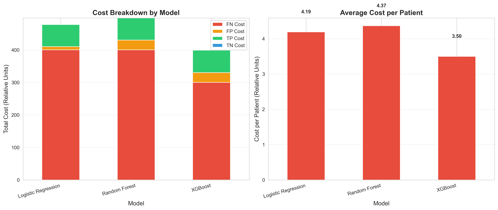

Cost-benefit analysis là bước thể hiện tư duy triển khai: mô hình tốt nhất về số liệu chưa chắc là mô hình phù hợp nhất về tài nguyên, tốc độ và khả năng vận hành trong hệ thống web.

#### 4.2.3 Quy trình huấn luyện và đánh giá DL (CBIS-DDSM)
Nhánh DL của đề tài được hoàn thiện dần theo các bước:

**a. Chuẩn bị dữ liệu ảnh**
- tổ chức ảnh vào `train/val/test`
- tiền xử lý ROI bằng `roi_preprocessing.py`
- loại bỏ nền đen, text dư và crop vùng mô vú

**b. Huấn luyện mô hình**
- thử nghiệm ResNet50, EfficientNet-B0, Custom CNN
- dùng `BinaryFocalCrossentropy`
- áp dụng class weights để đối phó mất cân bằng
- sử dụng `EarlyStopping`, `ReduceLROnPlateau`

**c. Đánh giá và hiệu chỉnh**
- tìm threshold tối ưu
- đánh giá `val_auc`, `test_tta_auc`
- xuất `calibration_profile.json`

**d. Làm mới artifact và promote mô hình mạnh nhất**
- `run_dl_retrain_pipeline.py`: chạy retrain tổng thể
- `compare_dl_summaries.py`: so sánh summary
- `promote_best_dl_model.py`: ghi nhận artifact tốt nhất vào calibration profile

**e. Baseline ảnh thủ công**
- `train_dl_image_rf.py` huấn luyện Random Forest trên đặc trưng ảnh thủ công
- đây là nhánh phụ trợ để so sánh, chưa phải lựa chọn tốt nhất

Nhờ đó, sản phẩm hiện có khả năng vừa phục vụ nghiên cứu kiến trúc ảnh, vừa phục vụ triển khai thực tế với một artifact ổn định hơn.

#### 4.2.4 Mô hình giải thích (XAI) và Trợ lý ảo
**SHAP**
- giải thích mô hình ML theo từng đặc trưng
- tạo summary plot, bar plot, waterfall plot
- hỗ trợ phân tích ca bệnh cá thể

**Grad-CAM**
- xác định vùng ảnh nhũ ảnh mô hình chú ý
- sinh heatmap và overlay lên ảnh gốc
- hiển thị trực tiếp trên frontend thông qua ảnh lưu ở `frontend/results/`

**Trợ lý ảo và AI Advisor**
- chatbot trả lời bằng tiếng Việt
- sinh lời khuyên theo mode `ml`, `dl`, `multimodal`
- fallback rõ ràng: Gemini → OpenAI → local
- có thêm luồng đọc ảnh phiếu xét nghiệm để điền các chỉ số lâm sàng theo kiến trúc OCR local trước, AI fallback sau

Sự kết hợp này giúp sản phẩm không chỉ “đoán” mà còn “giải thích” và “hướng dẫn tiếp theo”.

### 4.3 Kiểm thử sản phẩm
Quy trình kiểm thử của sản phẩm gồm:

**1. Kiểm thử chức năng**
- dự đoán ML với dữ liệu benign/malignant mẫu
- dự đoán DL với ảnh demo benign/malignant
- dự đoán multimodal
- đăng ký, đăng nhập, đổi mật khẩu, reset password
- tạo và quản lý bệnh nhân
- lưu và xem lại lịch sử dự đoán

**2. Kiểm thử tích hợp**
- phối hợp giữa frontend và backend
- phối hợp giữa prediction service, AI Advisor và database
- phối hợp giữa endpoint upload ảnh và lưu ảnh Grad-CAM

**3. Kiểm thử hệ thống**
- đo thời gian phản hồi API
- kiểm tra endpoint trạng thái model
- kiểm tra khả năng warmup mô hình DL
- kiểm tra Docker Compose và reverse proxy qua Nginx

**4. Công cụ kiểm thử**
- script `scripts/smoke_test_api.py`
- `curl` cho endpoint cục bộ
- dữ liệu mẫu trong `data/test_samples/`
- ảnh demo trong `frontend/assets/demo-images/`

### 4.4 Triển khai thực tế
Đề tài đã chuẩn bị đầy đủ cho triển khai thử nghiệm bằng Docker Compose.

**Môi trường triển khai**
- `api`: FastAPI + ML/DL models
- `web`: Nginx phục vụ frontend tĩnh và reverse proxy `/api` + `/results`

`docker-compose.yml`:

```yaml
services:
  api:
    build:
      context: .
      dockerfile: backend/Dockerfile
    volumes:
      - ./backend/data:/app/backend/data
      - ./models:/app/models
      - ./frontend/results:/app/frontend/results

  web:
    image: nginx:1.27-alpine
    ports:
      - "80:80"
```

**Cách chạy**

```bash
cp .env.example .env
mkdir -p backend/data frontend/results
docker compose up -d --build
```

**Tệp môi trường chính**
- `AI_ADVISOR_PROVIDER`
- `GEMINI_API_KEY`
- `OPENAI_API_KEY`
- `APP_MAIL_MODE`
- `DL_PRELOAD_ON_STARTUP`

**Tệp dữ liệu cần backup**
- `backend/data/app.db`
- `models/`
- `.env`

Với cấu trúc hiện tại, hệ thống đủ điều kiện để triển khai ở mức demo nội bộ, phòng thí nghiệm hoặc môi trường trình diễn nghiên cứu.

---

## CHƯƠNG V: HƯỚNG PHÁT TRIỂN VÀ MỞ RỘNG ĐỀ TÀI

### 5.1 Mở rộng đối tượng nhận diện
Trong tương lai, đề tài có thể mở rộng theo các hướng:
- Phân loại thêm các dạng tổn thương khác ngoài `Benign/Malignant`, ví dụ khối nghi ngờ, mức độ BI-RADS hoặc phân nhóm nguy cơ.
- Tích hợp thêm ảnh siêu âm vú, MRI vú hoặc ảnh mô bệnh học.
- Kết nối với hệ thống PACS hoặc HIS tại cơ sở y tế để khai thác dữ liệu thực tế hơn.
- Bổ sung thêm các dữ liệu nền như tiền sử gia đình, hormone, sinh thiết, receptor markers.

### 5.2 Ứng dụng trong thực tế
Hệ thống có thể được ứng dụng theo các hướng:
- Công cụ hỗ trợ sàng lọc ban đầu tại phòng khám hoặc cơ sở y tế tuyến đầu.
- Công cụ minh họa học thuật cho môn học AI y tế, xử lý ảnh y khoa hoặc hệ hỗ trợ quyết định.
- Môi trường thực nghiệm cho nhóm nghiên cứu tiếp tục đánh giá và so sánh mô hình mới.
- Hệ thống hỗ trợ bác sĩ theo dõi lịch sử dự đoán theo từng bệnh nhân trong quá trình khám thử nghiệm.

### 5.3 Cải thiện hiệu năng và tối ưu hệ thống
Những hướng tối ưu quan trọng nhất hiện nay gồm:
- Tăng **Specificity** cho nhánh DL để giảm báo động giả.
- Tinh chỉnh thêm ROI preprocessing, thresholding, augmentation và calibration.
- Chuyển artifact ổn định sang định dạng **ONNX** để tăng tốc suy luận.
- Cải thiện pipeline inference để giảm độ trễ của endpoint ảnh.
- Nâng cấp cơ sở dữ liệu từ SQLite sang PostgreSQL.
- Bổ sung cache và queue nếu triển khai nhiều yêu cầu đồng thời.

### 5.4 Xây dựng hệ thống huấn luyện tự động
Đây là hướng phát triển rất phù hợp với đề tài hiện tại vì repo đã có sẵn nhiều script tự động hóa:
- `train_ml_calibrated.py`
- `train_dl_finetune_calibrated.py`
- `run_dl_retrain_pipeline.py`
- `compare_dl_summaries.py`
- `promote_best_dl_model.py`

Trong tương lai có thể phát triển thành:
- pipeline CI/CD cho ML/DL,
- tự động retrain khi có dữ liệu mới,
- tự động so sánh, promote mô hình tốt nhất,
- lưu model registry và báo cáo thực nghiệm,
- sinh dashboard theo dõi drift và chất lượng mô hình theo thời gian.

---

## TÀI LIỆU THAM KHẢO

1. Wisconsin Diagnostic Breast Cancer Dataset (WDBC).
2. CBIS-DDSM - Curated Breast Imaging Subset of DDSM.
3. Tài liệu scikit-learn, XGBoost, TensorFlow/Keras, PyTorch.
4. Tài liệu FastAPI, Uvicorn, Docker, Nginx.
5. Tài liệu SHAP và Grad-CAM về Explainable AI.
6. Các notebook, script và artifact trong dự án Breast Cancer AI / BreastCare Mint.

---

## PHỤ LỤC

### Phụ lục 1. Các file quan trọng trong dự án
- `backend/app/main.py`
- `backend/app/api/endpoints.py`
- `backend/app/services/prediction.py`
- `backend/app/services/prediction_dl.py`
- `backend/app/services/ai_advisor.py`
- `src/explainability/shap_explainer.py`
- `src/explainability/gradcam.py`
- `scripts/train_ml_calibrated.py`
- `scripts/train_dl_finetune_calibrated.py`
- `scripts/run_dl_retrain_pipeline.py`

### Phụ lục 2. Các artifact thực nghiệm quan trọng
- `models/ml_retrain_report_20260404.json`
- `models/deep_learning/custom_cnn_finetuned_calibrated_refresh_summary.json`
- `models/deep_learning/calibration_profile.json`
- `experiments/results/phase2_summary.json`
- `src/experiments/results/wisconsin_test_results.csv`
- `src/experiments/results/cross_validation_summary.csv`
- `src/experiments/results/shap_feature_importance_xgboost.csv`
- `src/experiments/results/error_analysis_summary.csv`

### Phụ lục 3. Ghi chú học thuật và triển khai
- Nhánh ML hiện là phần có độ ổn định cao nhất của hệ thống.
- Nhánh DL đã được tích hợp đầy đủ vào web nhưng vẫn cần cải thiện thêm về độ đặc hiệu.
- Kết quả trả về của hệ thống chỉ phục vụ hỗ trợ sàng lọc, không thay thế chẩn đoán y khoa.
- Phiên bản cơ sở dữ liệu hiện tại dùng SQLite để phù hợp với demo nghiên cứu; production nên chuyển sang PostgreSQL.

### Phụ lục 4. Toàn bộ hình ảnh kết quả thực nghiệm từ notebooks
Phụ lục này tổng hợp toàn bộ các biểu đồ, hình so sánh và hình giải thích đã được export trong quá trình nghiên cứu từ các notebooks. Mục tiêu của phần này là cho thấy đầy đủ nhóm nghiên cứu đã thử nghiệm gì, so sánh gì và rút ra các quan sát nào trong quá trình phát triển hệ thống.

#### 4.1 Notebook 01 - Wisconsin EDA


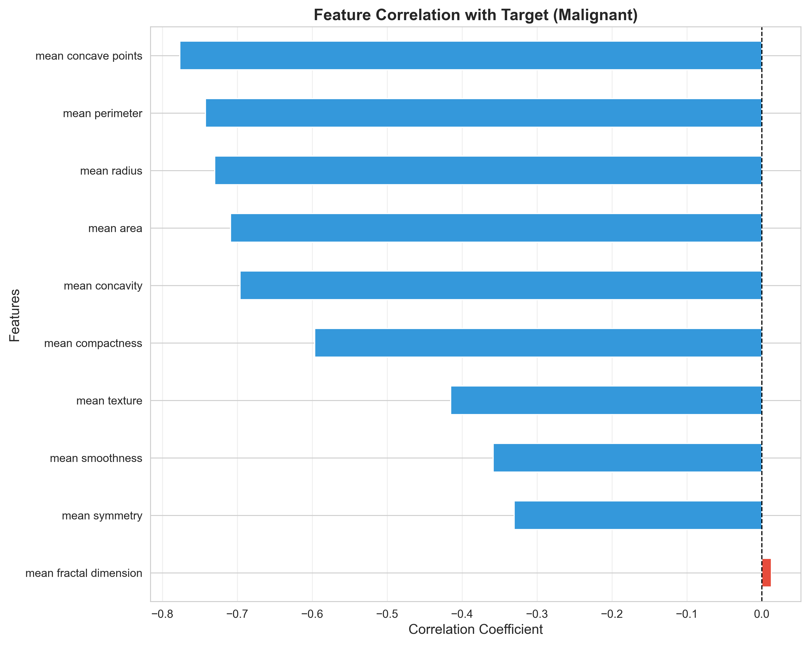

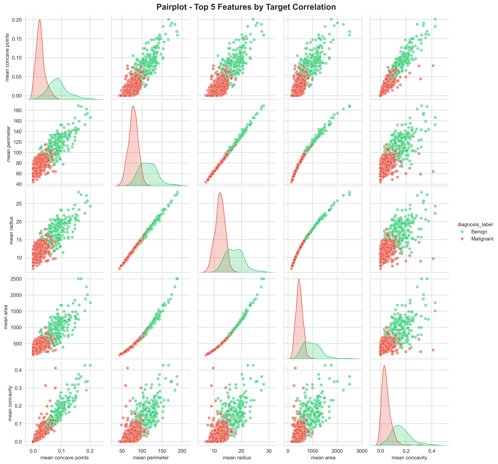

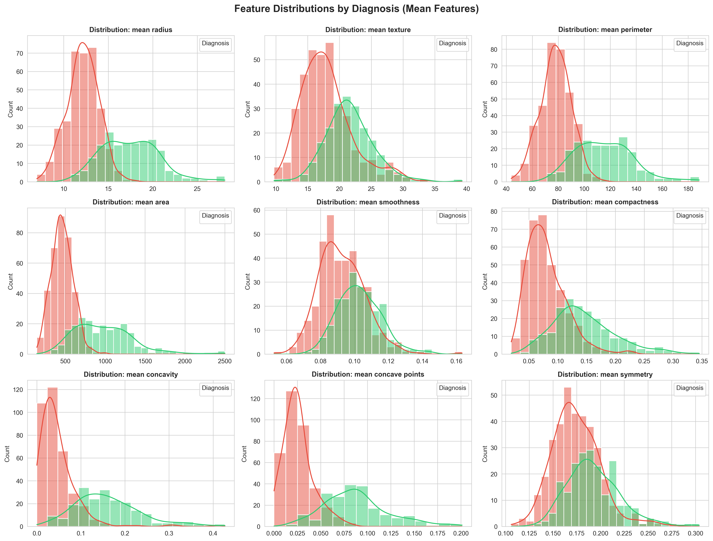

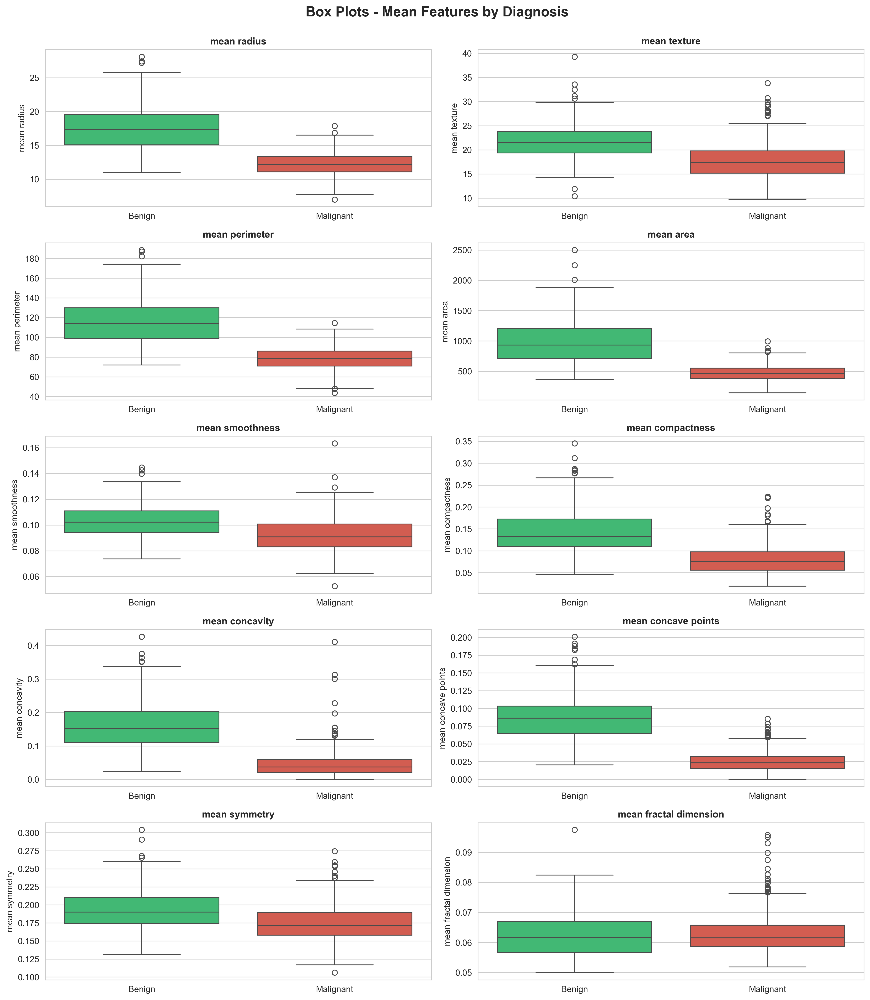

#### 4.2 Notebook 02 - Wisconsin Preprocessing


#### 4.3 Notebook 03 - Wisconsin Train Models


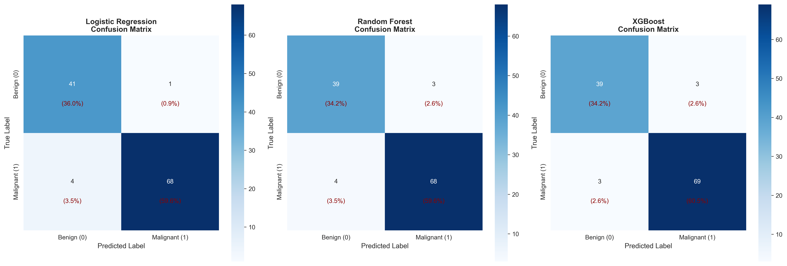


#### 4.4 Notebook 04 - SHAP Explainability


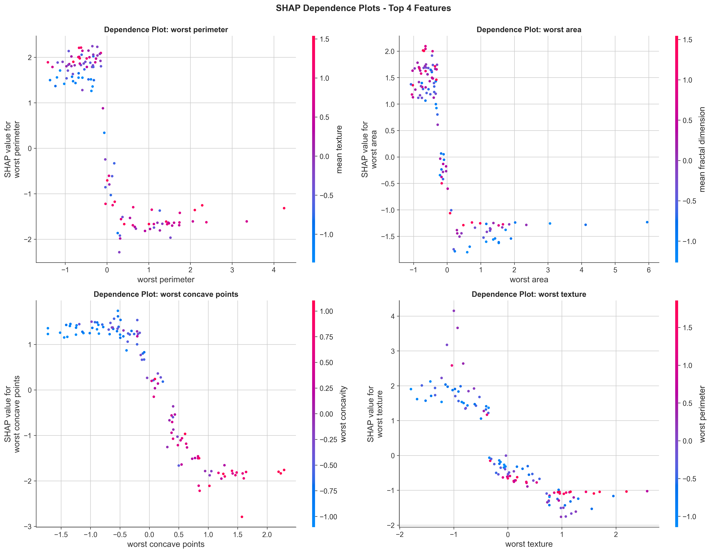


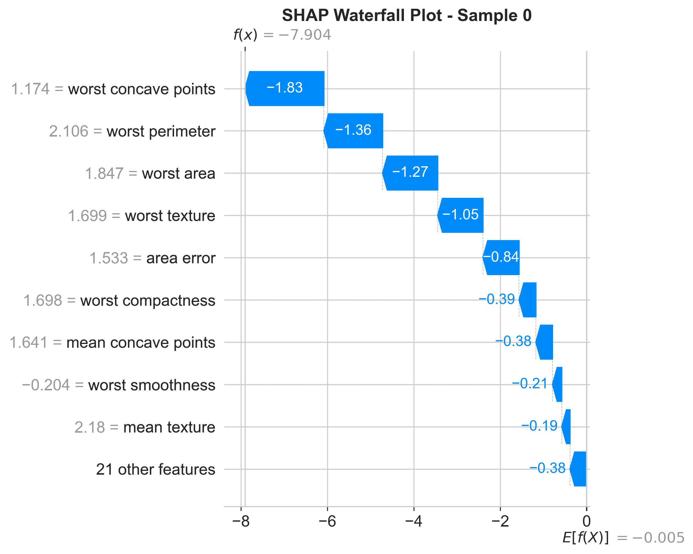


#### 4.5 Notebook 05 - Cross Validation và Bootstrap Analysis


#### 4.6 Notebook 06 - Error Analysis


#### 4.7 Notebook 07 - Feature Engineering và Feature Selection


#### 4.8 Comparative Study và Cost-Benefit Analysis


### Phụ lục 5. Ý nghĩa của các nhóm biểu đồ trong báo cáo
- Nhóm EDA chứng minh nhóm nghiên cứu đã khảo sát dữ liệu đầu vào, phân bố lớp và tương quan giữa các đặc trưng trước khi huấn luyện.
- Nhóm train/evaluation thể hiện việc so sánh đầy đủ giữa các mô hình ML bằng confusion matrix, ROC, PR, calibration và threshold optimization.
- Nhóm SHAP cho thấy đề tài không chỉ dừng ở độ chính xác mà còn phân tích tính giải thích của từng chỉ số lâm sàng.
- Nhóm cross-validation, bootstrap và error analysis phản ánh tư duy kiểm chứng độ ổn định, không chỉ báo cáo một lần đo duy nhất.
- Nhóm feature engineering và comparative study cho thấy có quá trình thử nghiệm nhiều hướng chọn đặc trưng, nhiều góc nhìn đánh giá và cân nhắc giữa hiệu năng với khả năng triển khai.
