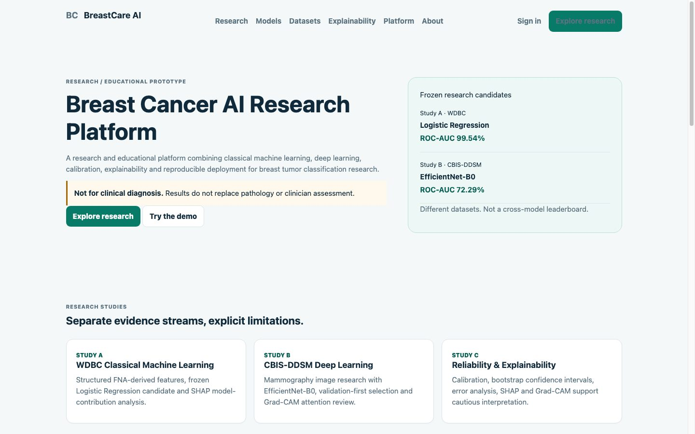
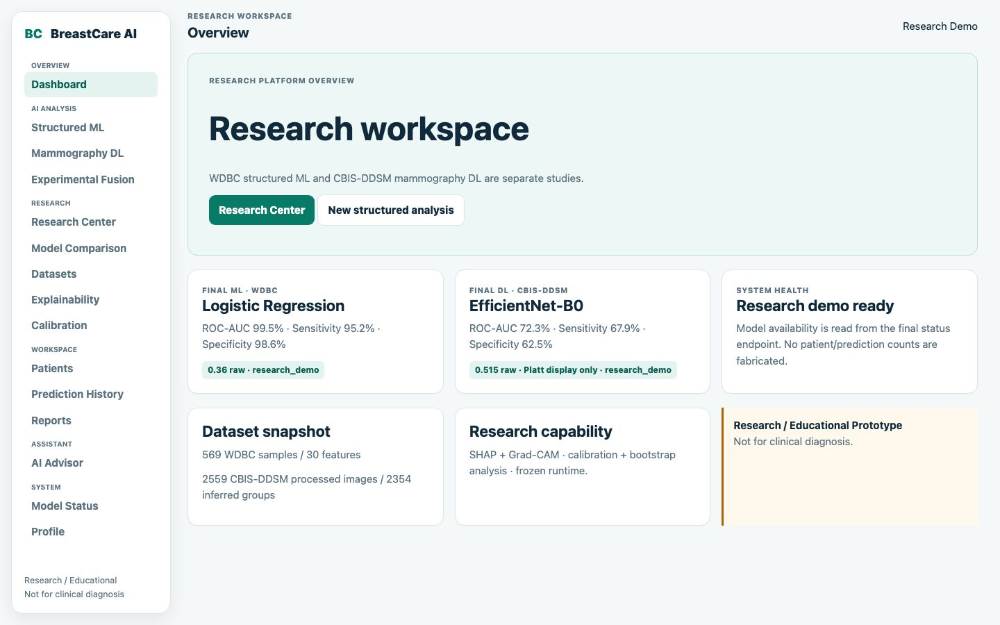

# Breast Cancer AI Research Platform

> **Research / Educational Prototype. Not for clinical diagnosis.** Model outputs do not replace pathology, radiology review, or qualified clinical assessment.

Breast Cancer AI is a reproducible research platform for benign-versus-malignant breast tumor classification. It combines two deliberately separate studies, reliability and explainability evidence, checksum-verified model runtimes, and a deployable web demonstration.



## Project Overview

The final scientific contract is:

- **Study A:** classical machine learning on 30 numerical FNA-derived cytological measurements from WDBC.
- **Study B:** deep learning on processed mammography images from CBIS-DDSM.
- **Study C:** calibration, uncertainty, error analysis, SHAP, and Grad-CAM characterization.
- **Software demo:** independent ML and DL inference plus an explicitly experimental multimodal heuristic.

WDBC and CBIS-DDSM are different, unpaired datasets. Their metrics are reported separately and must not be interpreted as a shared leaderboard.

## Research Design

### Study A - WDBC ML

WDBC contains 569 samples, 30 numerical FNA-derived cytological features, 212 malignant labels, and 357 benign labels. A seed-42 stratified outer split reserves 114 samples as held-out test data and retains 455 development samples. Logistic Regression, Random Forest, and XGBoost were compared using five-fold out-of-fold development evidence.

Logistic Regression is the primary candidate. Selection was made from development OOF evidence, before held-out test description.

### Study B - CBIS-DDSM DL

The local processed snapshot contains 2,559 full images and 2,559 ROI representations, represented by 5,118 manifest rows. Those rows are **not** 5,118 independent mammograms or patients. A filename-derived protocol forms 2,354 inferred study-like groups and produces train/validation/test group counts of 1,648/353/353 with zero measured group overlap.

This is not a verified patient-level split because complete patient/case metadata was unavailable. Custom CNN, ResNet50, and EfficientNet-B0 were evaluated under the frozen protocol. EfficientNet-B0 with full processed images was retained using validation-first model and representation decisions.

### Study C - Reliability and Explainability

Reliability analysis includes frozen thresholds, calibration, bootstrap confidence intervals, and error summaries. SHAP characterizes Logistic Regression contributions to malignant log-odds. Grad-CAM provides coarse attention visualization for EfficientNet-B0. Neither method proves medical causality or clinical validity.

## Final Research Results

### WDBC Logistic Regression

| Metric | Held-out test |
| --- | ---: |
| Accuracy | 0.9737 |
| Sensitivity | 0.9524 |
| Specificity | 0.9861 |
| Balanced accuracy | 0.9692 |
| ROC-AUC | 0.9954 |
| PR-AUC | 0.9932 |
| TN / FP / FN / TP | 71 / 1 / 2 / 40 |

Runtime classification uses raw malignant probability `>= 0.36`.

### CBIS-DDSM EfficientNet-B0

| Metric | Final test |
| --- | ---: |
| Accuracy | 0.6480 |
| Sensitivity | 0.6786 |
| Specificity | 0.6250 |
| Balanced accuracy | 0.6518 |
| ROC-AUC | 0.7229 |
| PR-AUC | 0.6564 |
| Brier score | 0.2297 |
| TN / FP / FN / TP | 140 / 84 / 54 / 114 |

Runtime classification uses raw malignant probability `>= 0.515`. The moderate DL performance and remaining uncertainty make this research-grade evidence, not clinical performance.

## Datasets

| Study | Source | Final local protocol |
| --- | --- | --- |
| WDBC ML | `sklearn.datasets.load_breast_cancer` / UCI WDBC | 455 development, 114 held-out test, seed 42 |
| CBIS-DDSM DL | Processed CBIS-DDSM snapshot | 2,354 inferred study-like groups; zero measured split overlap |

Raw datasets are not committed. See [DATASET_SETUP.md](docs/DATASET_SETUP.md), [DATA_CARD.md](docs/DATA_CARD.md), and [FINAL_DATASET_PROTOCOL.md](docs/FINAL_DATASET_PROTOCOL.md).

## Final Models

- **ML:** checksum-verified Logistic Regression pipeline, frozen raw threshold `0.36`.
- **DL:** checksum-verified EfficientNet-B0 full-image model, frozen raw threshold `0.515`.
- **Calibration:** frozen Platt artifact supplies the DL display/reliability probability only.

The ROI ablation reduced validation ROC-AUC from 0.7044 to 0.6789 and sensitivity from 0.6813 to 0.5125. The validation-first `ROI-C` decision retained full processed images.

## Calibration

For DL validation, Platt scaling improved Brier score from approximately 0.2327 to 0.2118 and ECE from approximately 0.1139 to 0.0221. Calibration does not change classification:

```text
classification = raw_probability >= 0.515
display_probability = frozen Platt(raw_probability)
```

## Explainability

- **SHAP:** WDBC Logistic Regression feature contributions to malignant log-odds; post-hoc and non-causal.
- **Grad-CAM:** CBIS-DDSM EfficientNet-B0 coarse model attention; not lesion segmentation, lesion localization, pathology ground truth, or causal explanation.

Reproducible figures and tables are in `paper_artifacts/`.

## Experimental Multimodal Demo

The software exposes the heuristic `0.4 * ML + 0.6 * DL`. This feature is `experimental_only`. WDBC and CBIS-DDSM are unpaired, so there is no validated same-patient multimodal study and no final multimodal accuracy claim.

## Application Features

The 21 canonical routes cover Landing/Auth, Dashboard, Structured ML, Mammography DL, Experimental Fusion, Research Center, Model Comparison, Dataset Explorer, Explainability, Calibration, Patients, Patient Detail, History, Reports, AI Advisor, Model Status, and Profile workflows.



## Architecture

```text
Browser -> Nginx -> static HTML/CSS/ES modules
                 -> /api proxy -> FastAPI -> SQLite
                                      |-> frozen ML runtime
                                      |-> frozen DL + Platt runtime
```

The Docker Compose API mounts `runtime_models/` read-only. Final runtimes verify SHA-256 before serving inference and fail closed when artifacts are missing or invalid.

## Frontend Architecture V2

The frozen frontend uses static HTML/CSS and vanilla JavaScript ES Modules: `core/` for API/auth/guards, `services/` for HTTP contracts, `components/` for shared UI, and `pages/` for one controller per canonical route. The former `app.js`, `styles.css`, and `premium.css` monoliths were removed.

Final browser QA covered 21 routes at four viewports for 84/84 passes. See [FRONTEND_ARCHITECTURE_V2.md](docs/FRONTEND_ARCHITECTURE_V2.md) and [FRONTEND_FINAL_QA.md](docs/FRONTEND_FINAL_QA.md).

## Local Setup

Python 3.11 is the supported container runtime. For backend development:

```bash
python3 -m venv venv
source venv/bin/activate
pip install -r requirements-dev.txt
cp .env.example .env
PYTHONPATH=backend uvicorn app.main:app --reload
```

Serve `frontend/` through Nginx/Docker for the canonical proxy contract. Do not commit `.env`, SQLite data, patient-entered data, or model weights.

## Runtime Model Artifacts

Place the externally distributed frozen files at:

```text
runtime_models/logistic_regression_final_seed42.joblib
runtime_models/efficientnetb0_final_seed42.keras
```

Verify checksums and provenance using [MODEL_ARTIFACTS.md](docs/MODEL_ARTIFACTS.md). Model binaries remain outside normal Git history.

## Docker

```bash
cp .env.example .env
mkdir -p backend/data frontend/results runtime_models
docker compose config
docker compose build
docker compose up -d
docker compose ps
curl -fsS http://127.0.0.1/healthz
curl -fsS http://127.0.0.1/readyz
```

Stop without deleting persisted volumes: `docker compose down`.

## Testing

```bash
find frontend/js -name "*.js" -print0 | xargs -0 -n1 node --check
python3 scripts/verify_frontend_v2.py
PYTHONPATH=.:backend venv/bin/python -m pytest -q
python3 -m compileall backend/app scripts tests
PYTHONPATH=.:backend venv/bin/python scripts/verify_final_application.py
PYTHONPATH=.:backend venv/bin/python scripts/verify_production_readiness.py
```

## Reproducibility

`experiments/final/FINAL_RESULTS_SNAPSHOT.json` is the machine-readable source of truth. `paper_artifacts/MANIFEST.json` records table/figure provenance. Final scientific choices are frozen; reproduction requires the recorded split, seed, configurations, and external datasets/model artifacts.

## Safety and Limitations

- Research and education only; `clinical_use=false`.
- No external validation is included.
- CBIS-DDSM grouping is inferred study-like grouping, not verified patient-level grouping.
- DL discrimination is moderate and uncertainty remains material.
- ML and DL metrics cannot be ranked across their different datasets.
- Experimental fusion has no paired-data validation.
- SHAP is non-causal; Grad-CAM is qualitative.
- SQLite and local-storage bearer authentication suit the current research demo, not a regulated clinical system.

See [FINAL_SAFETY_REVIEW.md](docs/FINAL_SAFETY_REVIEW.md).

## Repository Structure

```text
backend/            FastAPI application and final runtime services
frontend/           static Frontend Architecture V2
deploy/             Nginx configuration
docs/               research, operations, QA, and release documentation
experiments/final/  frozen machine-readable research evidence
manifests/          leakage-controlled CBIS-DDSM split manifest
models/             calibration metadata and registry example, not weights
paper_artifacts/    reproducible final tables and figures
scripts/            research, validation, backup, and report utilities
tests/              backend/runtime contract tests
```

## Research Team

**Students:** Nguyễn Bá Duy, Trần Mỹ Anh, Hoàng Nhật Anh, Nguyễn Huy Giang, Ngô Tiến Đạt<br>
**Supervisor:** Đoàn Thị Thanh Hằng

Official report: [Vietnamese source](docs/report/FINAL_RESEARCH_REPORT_VI.md) | [DOCX](docs/report/NGHIEN_CUU_CAC_MO_HINH_NHAN_DANG_PHAN_LOAI_KHOI_U_VU_AC_TINH.docx) | [PDF](docs/report/NGHIEN_CUU_CAC_MO_HINH_NHAN_DANG_PHAN_LOAI_KHOI_U_VU_AC_TINH.pdf)
