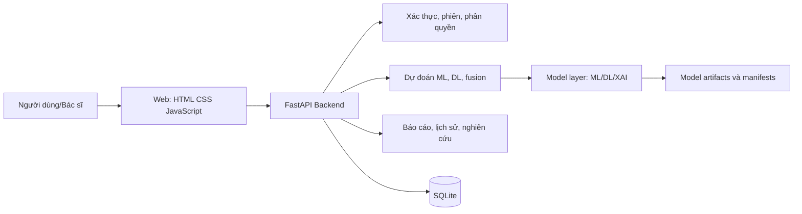
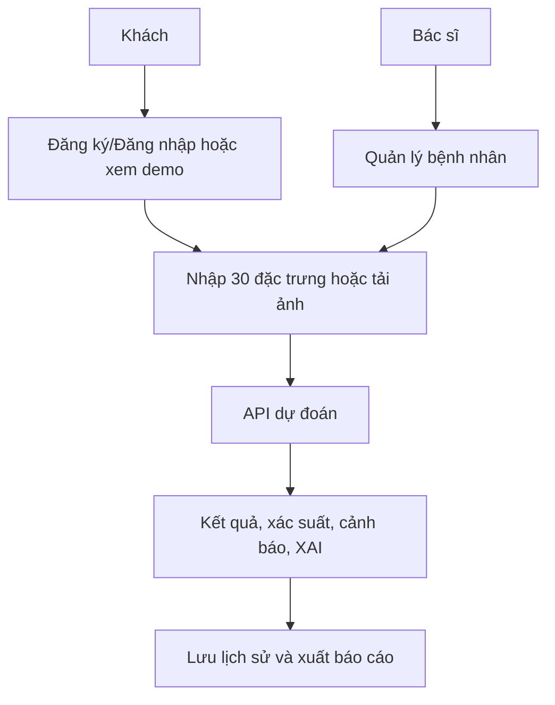

# TỔNG QUAN ĐỀ TÀI NGHIÊN CỨU VÀ HỆ THỐNG BREAST CANCER AI

**Hệ thống hỗ trợ nghiên cứu sàng lọc ung thư vú dựa trên Machine Learning, Deep Learning và phân tích đa phương thức**

> Research / Educational Prototype - Not for clinical diagnosis. Hệ thống không phải thiết bị chẩn đoán y khoa và không thay thế bác sĩ hay quy trình lâm sàng.

## 1. Thông tin đề tài

- **Tên đề tài:** Nghiên cứu và xây dựng hệ thống hỗ trợ sàng lọc ung thư vú sử dụng Machine Learning, Deep Learning và dữ liệu đa phương thức.
- **Tên tiếng Anh:** Research and Development of a Breast Cancer Screening Support System Using Machine Learning, Deep Learning, and Multimodal Data.
- **Lĩnh vực:** Trí tuệ nhân tạo y sinh, học máy, thị giác máy tính, kỹ nghệ phần mềm và MLOps.
- **Loại hình:** Đề tài nghiên cứu khoa học sinh viên kèm hệ thống phần mềm minh họa đầu-cuối.
- **GitHub:** https://github.com/HuyGiang1/breast-cancer-ai
- **Đối tượng nghiên cứu:** Dữ liệu đặc trưng khối u dạng bảng WDBC và ảnh nhũ ảnh CBIS-DDSM đã xử lý.

## 2. Tóm tắt đề tài

Ung thư vú là một bài toán sàng lọc có yêu cầu cao về độ nhạy, khả năng giải thích và sự trung thực khi truyền đạt mức độ không chắc chắn. Đề tài xây dựng một nguyên mẫu nghiên cứu kết hợp hai hướng: Machine Learning (ML) trên dữ liệu lâm sàng/cấu trúc và Deep Learning (DL) trên ảnh nhũ ảnh.

Hệ thống tổ chức lại quy trình từ dữ liệu, chia tập, huấn luyện, đánh giá, hiệu chỉnh xác suất, giải thích mô hình, phục vụ dự đoán bằng FastAPI, đến giao diện web, Docker và chuẩn bị triển khai. Mục đích là tạo một nền tảng có thể tái lập thí nghiệm và trình diễn quy trình nghiên cứu, không phải sản phẩm chẩn đoán dùng trong thực hành lâm sàng.

## 3. Bài toán nghiên cứu

### 3.1. Dữ liệu có cấu trúc

Phân loại lành tính/ác tính từ 30 đặc trưng số của WDBC bằng các mô hình ML đã hiệu chỉnh xác suất.

### 3.2. Dữ liệu ảnh

Phân loại ảnh nhũ ảnh đã xử lý từ CBIS-DDSM bằng Custom CNN, ResNet50 và EfficientNet-B0 với một manifest chia nhóm bảo toàn tính độc lập theo nhóm suy ra.

### 3.3. Đa phương thức

Giao diện có khả năng kết hợp xác suất ML và DL. Kết luận khoa học về đa phương thức chỉ được đưa ra khi có dữ liệu clinical-image ghép cặp hợp lệ và đánh giá độc lập tương ứng.

## 4. Mục tiêu nghiên cứu

Mục tiêu chung là xây dựng và đánh giá một hệ thống hỗ trợ sàng lọc ung thư vú có quy trình nghiên cứu tái lập được.

Các mục tiêu cụ thể gồm: xây dựng pipeline ML và DL; kiểm soát leakage; đánh giá bằng các thước đo lâm sàng phù hợp; hiệu chỉnh xác suất và chọn ngưỡng trên validation; SHAP/Grad-CAM; tích hợp web/API; Docker hóa; quản lý artifact; và chuẩn hóa quy trình tái lập.

## 5. Câu hỏi nghiên cứu

- **RQ1:** Mô hình ML nào phù hợp nhất cho WDBC trong thiết lập tái lập được?
- **RQ2:** Các kiến trúc DL hoạt động thế nào trên CBIS-DDSM khi dùng chia tập an toàn theo nhóm?
- **RQ3:** Xác suất dự đoán có đủ được hiệu chỉnh để truyền đạt rủi ro nghiên cứu không?
- **RQ4:** Các lỗi false negative/false positive cho thấy giới hạn gì của mô hình?
- **RQ5:** Khi có dữ liệu ghép cặp hợp lệ, fusion đa phương thức có cải thiện so với từng nguồn đơn lẻ không?

## 6. Kiến trúc tổng thể



Giao diện tĩnh gọi API; backend điều phối xác thực, dữ liệu bệnh nhân, dự đoán và báo cáo; tầng mô hình nạp artifact ngoài Git; SQLite lưu dữ liệu của bản demo/research.

## 7. Công nghệ sử dụng

| Nhóm | Công nghệ |
| --- | --- |
| Ngôn ngữ và API | Python, FastAPI, Pydantic |
| ML/DL | scikit-learn, TensorFlow/Keras, NumPy, Pandas; XGBoost khi pipeline đủ điều kiện |
| XAI | SHAP, Grad-CAM |
| Dữ liệu | WDBC, CBIS-DDSM, CSV/JSON manifest |
| Frontend | HTML, CSS, JavaScript |
| CSDL | SQLite |
| Vận hành | Docker, Docker Compose, Nginx, Git, GitHub Actions |

## 8. Dữ liệu sử dụng

WDBC gồm 569 mẫu, 30 đặc trưng số, nhãn lành tính/ác tính; dùng cho Study A (ML). CBIS-DDSM là ảnh nhũ ảnh; ảnh gốc, ROI và trọng số mô hình không nằm trong Git thông thường.

Manifest `cbis_group_split_seed42` có 5.118 dòng biểu diễn hai dạng ảnh và 2.354 nhóm. Nhóm được suy ra từ tiền tố tên tệp trước `__`; đó là **study-like grouping / conservative group split**, không phải khẳng định chia theo bệnh nhân vì snapshot cục bộ chưa có metadata ca bệnh đầy đủ. Manifest hiện không có giao nhau nhóm giữa train, validation và test.

## 9. Luồng xử lý dữ liệu

```text
Raw data -> cleaning/preprocessing -> group split manifest -> train -> validation -> locked test
```

Augmentation chỉ dùng ở train. Scaler, calibration, lựa chọn threshold và lựa chọn kiến trúc không được dùng test để điều chỉnh. Test chỉ dùng cho đánh giá cuối độc lập.

## 10. Module Machine Learning

Pipeline ML nhận 30 đặc trưng, chuẩn hóa trong pipeline huấn luyện và xuất xác suất ác tính. Các mô hình nghiên cứu gồm Logistic Regression và Random Forest; XGBoost chỉ được đưa vào so sánh khi dependency, training và artifact hoạt động nhất quán. Calibration được đặt trong quy trình đánh giá, không phải chỉ là định dạng hiển thị.

## 11. Module Deep Learning

DL nhận ảnh đã xử lý, áp dụng tiền xử lý tương ứng từng kiến trúc, rồi xuất xác suất ác tính và nhãn theo threshold đã chọn từ validation. Ba kiến trúc cuối dự kiến so sánh là Custom CNN, ResNet50 và EfficientNet-B0. Custom CNN là baseline phù hợp với miền dữ liệu; các backbone pretrained dùng để khảo sát transfer learning. Grad-CAM là lớp diễn giải thị giác đi kèm kết quả.

## 12. Khả năng giải thích (XAI)

Với ML, hệ thống sử dụng hệ số/feature importance và SHAP để trình bày các đặc trưng có ảnh hưởng. Với DL, Grad-CAM biểu diễn vùng mà mạng quan tâm khi đưa ra dự đoán. Các phương pháp này hỗ trợ kiểm tra và giao tiếp nghiên cứu; không chứng minh mô hình đúng hay xác nhận vùng ung thư trên ảnh.

## 13. Calibration và threshold

Trong sàng lọc, xác suất cần có ý nghĩa hơn một nhãn nhị phân đơn thuần. Kết quả cuối sẽ báo cáo calibration curve, Brier score, threshold curve và, khi phù hợp, khoảng tin cậy. Threshold được chọn trên validation theo tiêu chí đã công bố trước; test không được dùng để chọn threshold.

## 14. Experimental Multimodal Integration

Luồng phần mềm hiện kết hợp `0.4 * P_ml + 0.6 * P_dl`. Đây là **Demo Fusion Heuristic**, phục vụ trải nghiệm tích hợp giữa hai kênh đầu vào. Trọng số này không được xem là đã kiểm chứng khoa học. WDBC và CBIS-DDSM không mặc nhiên là dữ liệu ghép cặp; do đó đa phương thức hiện là thí nghiệm sản phẩm, không phải đóng góp khoa học chính.

## 15. Thước đo đánh giá

| Thước đo | Ý nghĩa |
| --- | --- |
| Accuracy, Precision, F1 | Hiệu năng phân loại tổng quát |
| Sensitivity/Recall, False Negative | Khả năng không bỏ sót mẫu ác tính |
| Specificity, False Positive | Khả năng tránh báo động giả |
| Balanced Accuracy | Phù hợp khi mất cân bằng lớp |
| ROC-AUC, PR-AUC | Khả năng xếp hạng xác suất |
| Confusion matrix | TN, FP, FN, TP |
| Brier score, calibration curve | Chất lượng xác suất |
| Bootstrap 95% CI | Mức độ bất định của chỉ số, nếu khả thi |

## 16. Bảng kết quả cuối

| Mô hình | Dataset | Kết quả cuối |
| --- | --- | --- |
| Logistic Regression | WDBC | [Cập nhật sau thí nghiệm cuối tái lập] |
| Random Forest | WDBC | [Cập nhật sau thí nghiệm cuối tái lập] |
| Custom CNN | CBIS-DDSM | [Cập nhật sau đánh giá test theo manifest an toàn] |
| ResNet50 | CBIS-DDSM | [Cập nhật sau đánh giá test theo manifest an toàn] |
| EfficientNet-B0 | CBIS-DDSM | [Cập nhật sau đánh giá test theo manifest an toàn] |
| Multimodal | Paired data hợp lệ | Chưa kết luận khi chưa có dữ liệu ghép cặp |

Không sử dụng metric DL của pipeline split cũ làm kết luận nghiên cứu cuối.

## 17. Ứng dụng web

Ứng dụng bao gồm trang chủ, đăng ký/đăng nhập, hồ sơ, dự đoán lâm sàng ML, dự đoán ảnh DL, experimental multimodal, BreastCare Assistant, quản lý bệnh nhân cho vai trò bác sĩ, lịch sử dự đoán, xuất báo cáo HTML, dashboard thống kê/nghiên cứu và hiển thị giải thích mô hình.

## 18. Luồng người dùng



## 19. Backend

FastAPI cung cấp API cho đăng ký/đăng nhập/phiên, hồ sơ, reset mật khẩu, bệnh nhân, lịch sử dự đoán, xuất báo cáo, chat, research summary, model health, ML/DL/multimodal prediction. Hai endpoint vận hành là `/healthz` và `/readyz`.

## 20. Cơ sở dữ liệu

SQLite hiện có các bảng `users`, `sessions`, `password_reset_tokens`, `patients`, `predictions`, `chat_messages`. Thiết kế này phù hợp demo nghiên cứu hoặc ít người dùng. Khi triển khai công khai có đồng thời cao, PostgreSQL là hướng mở rộng hợp lý.

## 21. Bảo mật và riêng tư

Mật khẩu được băm PBKDF2-HMAC-SHA256; phiên dùng bearer token ngẫu nhiên; các route bệnh nhân yêu cầu vai trò bác sĩ và kiểm tra quyền sở hữu. API có kiểm tra MIME/kích thước upload, CORS theo biến môi trường, lỗi nội bộ tổng quát và `.env` không được commit. Bản demo công khai chỉ dùng dữ liệu tổng hợp/mẫu, không dùng thông tin bệnh nhân thật.

## 22. GitHub repository

Repository chính thức là `HuyGiang1/breast-cancer-ai`. Git history đã được dọn để không chứa raw CBIS-DDSM, `.keras`, `.pkl`, `.env`, `.pyc` hay runtime SQLite. Mã nguồn, manifest nhỏ, scripts, tests, CI và tài liệu được giữ trong Git để review và tái lập.

## 23. CI/CD

GitHub Actions hiện chạy khi push/pull request vào `main`: cài dependency tối thiểu, compile Python, pytest, import FastAPI và audit split nếu dữ liệu cục bộ tồn tại. CI là kiểm tra liên tục; CD tự động deploy chưa được khẳng định là đã triển khai.

## 24. Docker

Docker Compose bao gồm API FastAPI và Nginx phục vụ frontend tĩnh/reverse proxy `/api`. Các thư mục database, models và frontend results được mount volume để dữ liệu vận hành không bị đóng gói vào image.

## 25. Kiến trúc triển khai mục tiêu

```text
Internet -> Domain + HTTPS -> Nginx -> static web + /api FastAPI -> models + persistent SQLite
```

Mục tiêu là Ubuntu VPS chạy Docker Compose, Nginx, domain, HTTPS, `.env` production, volume model/DB, backup và healthcheck. Bước triển khai thực tế bắt đầu khi có VPS, domain và quyền truy cập.

## 26. Quản lý model artifact

Trọng số `.keras` và artifact ML không nằm trong Git thường. Artifact cuối cần version, SHA-256, input size, threshold, manifest nguồn và tham chiếu file metrics; phân phối qua GitHub Release hoặc server model volume. Xem `docs/MODEL_ARTIFACTS.md`.

## 27. Tái lập nghiên cứu

Quy trình chuẩn: clone repository -> tạo môi trường -> tải dữ liệu theo hướng dẫn -> tạo/kiểm tra manifest -> train ML -> train DL từ manifest -> đánh giá -> tạo figures/tables -> chạy API/web. Mọi seed, cấu hình và output cuối phải được lưu cùng run.

## 28. Kiểm thử

Kiểm thử gồm compile, pytest schemas, API smoke test, health/readiness, model status, kiểm tra upload, và audit leakage của manifest. Test DL trong CI không tải dữ liệu/model nhiều GB; chúng kiểm tra logic và contract, còn thí nghiệm đầy đủ chạy ở môi trường nghiên cứu.

## 29. Sản phẩm bàn giao cuối

Source code và GitHub; ML/DL artifacts kèm registry; web/API/database; manifest và protocol; metrics, ROC/PR, confusion, calibration, error analysis; SHAP, Grad-CAM, Model Card/Data Card; Docker/VPS package; tài liệu nghiên cứu; báo cáo và video demo.

## 30. Đóng góp dự kiến

Đóng góp nghiên cứu là quy trình so sánh ML và DL được kiểm soát leakage ở mức metadata sẵn có, có đánh giá calibration/XAI/error analysis. Đóng góp kỹ thuật là một nguyên mẫu end-to-end có xác thực, quản lý bệnh nhân, lưu lịch sử, báo cáo, CI và triển khai container. Đây là đóng góp triển khai và đánh giá có trách nhiệm, không tuyên bố thuật toán mới vượt trội.

## 31. Giới hạn

Hệ thống là research prototype; dữ liệu CBIS cục bộ chưa chứng minh độc lập theo bệnh nhân; chưa có external validation; khả năng tổng quát hóa sang ảnh/DICOM/bệnh viện khác chưa được xác nhận; multimodal cần dữ liệu ghép cặp; và XAI không thay thế đánh giá lâm sàng.

## 32. Hướng phát triển

Xác thực ngoài tập dữ liệu, bổ sung metadata ca bệnh, DICOM/PACS, dữ liệu đa phương thức ghép cặp, prospective validation, PostgreSQL/object storage, theo dõi model/drift, inference có khả năng mở rộng và quy trình quản trị dữ liệu y tế phù hợp.

## 33. Lộ trình hoàn thiện và nghiệm thu

1. Chốt thống kê và protocol dataset từ manifest.
2. Chuyển DL training sang manifest-driven, thêm test integrity.
3. Huấn luyện lại ba kiến trúc DL và khóa final test.
4. Đánh giá ML/DL, calibration, threshold, CI và error analysis.
5. Tạo SHAP/Grad-CAM và paper artifacts.
6. Chọn và promote model theo sensitivity, FN, calibration và độ ổn định.
7. Kết nối artifact cuối vào backend/dashboard, hoàn thiện frontend/test.
8. Hoàn thiện Docker, backup, release package và docs.
9. Khi có VPS/domain: triển khai HTTPS, xác minh public demo và phát hành release.

## 34. Checklist nghiệm thu cuối

- [ ] Dataset protocol và split kiểm soát leakage được xác nhận.
- [ ] ML final evaluation tái lập được.
- [ ] DL final evaluation dùng manifest an toàn.
- [ ] Multimodal chỉ có kết luận khi paired data hợp lệ.
- [ ] Calibration, threshold và false-negative analysis hoàn tất.
- [ ] SHAP và Grad-CAM được tạo với chú thích đúng giới hạn.
- [ ] Web/backend flows hoàn chỉnh và có disclaimer.
- [ ] Compile, pytest, smoke test, CI và Docker production pass.
- [ ] GitHub sạch, không có secret/data/model runtime.
- [ ] Artifact registry, deployment package, backup và tài liệu bàn giao hoàn tất.
