# NGHIÊN CỨU CÁC MÔ HÌNH NHẬN DẠNG, PHÂN LOẠI CÁC KHỐI U VÚ ÁC TÍNH

**Research on AI Models for Detection and Classification of Malignant Breast Tumors**

**BÁO CÁO NGHIÊN CỨU KHOA HỌC SINH VIÊN**

**Sinh viên thực hiện:** Nguyễn Bá Duy; Trần Mỹ Anh; Hoàng Nhật Anh; Nguyễn Huy Giang; Ngô Tiến Đạt

**Giảng viên hướng dẫn:** Đoàn Thị Thanh Hằng

**Năm:** 2026

**Phạm vi sử dụng:** Nghiên cứu và giáo dục. Không sử dụng cho chẩn đoán lâm sàng.

<!-- PAGEBREAK -->

# TÓM TẮT

Đề tài xây dựng một quy trình nghiên cứu và nền tảng phần mềm cho bài toán phân loại lành tính - ác tính ở u vú. Thiết kế cuối gồm hai nghiên cứu độc lập: Study A sử dụng 30 đặc trưng số có nguồn gốc từ phép đo tế bào học chọc hút kim nhỏ trong bộ WDBC; Study B sử dụng ảnh nhũ ảnh đã xử lý từ CBIS-DDSM. Một lớp phân tích thứ ba khảo sát độ tin cậy, hiệu chỉnh xác suất, sai số và khả năng giải thích. Việc tách hai nghiên cứu là bắt buộc vì dữ liệu không ghép cặp và khác về quần thể, phương thức đo cũng như giao thức chia tập.

Ở Study A, 569 mẫu WDBC gồm 212 ác tính và 357 lành tính được chia theo seed 42 thành 455 mẫu phát triển và 114 mẫu kiểm tra giữ lại. Logistic Regression, Random Forest và XGBoost được so sánh bằng dự đoán out-of-fold năm phần trên tập phát triển. Logistic Regression được chọn trước khi mô tả tập kiểm tra. Trên tập kiểm tra, mô hình đạt ROC-AUC 0,9954, PR-AUC 0,9932, độ nhạy 0,9524, độ đặc hiệu 0,9861 và balanced accuracy 0,9692, với 2 âm tính giả và 1 dương tính giả. Hợp đồng runtime phân lớp từ xác suất ác tính thô với ngưỡng 0,36.

Ở Study B, snapshot cục bộ có 2.559 ảnh nguồn đã xử lý và 2.559 biểu diễn ROI, tạo 5.118 dòng manifest. Các dòng này không tương đương 5.118 ảnh chụp độc lập hoặc bệnh nhân độc lập. Giao thức filename-prefix tạo 2.354 nhóm giống nghiên cứu với số nhóm train/validation/test là 1.648/353/353 và không phát hiện chồng lấn nhóm giữa các tập. Đây không phải chia tập mức bệnh nhân đã xác minh. Trong ba kiến trúc Custom CNN, ResNet50 và EfficientNet-B0, EfficientNet-B0 trên ảnh đầy đủ được giữ lại theo bằng chứng validation. Trên test, mô hình đạt ROC-AUC 0,7229, PR-AUC 0,6564, độ nhạy 0,6786, độ đặc hiệu 0,6250 và balanced accuracy 0,6518.

Hiệu chỉnh Platt cải thiện Brier validation từ khoảng 0,2327 xuống 0,2118 và ECE từ khoảng 0,1139 xuống 0,0221. Tuy nhiên, phân lớp DL vẫn dùng xác suất thô với ngưỡng 0,515; xác suất Platt chỉ dùng để hiển thị và diễn giải độ tin cậy. SHAP mô tả đóng góp vào log-odds của Logistic Regression, còn Grad-CAM mô tả vùng chú ý thô của EfficientNet-B0. Hai kỹ thuật không chứng minh quan hệ nhân quả hay giá trị lâm sàng.

Nền tảng cuối sử dụng FastAPI, SQLite, frontend HTML/CSS và JavaScript ES Modules, Nginx và Docker Compose. Hai model runtime được kiểm tra checksum và thất bại có kiểm soát khi artifact không hợp lệ. Hệ thống là prototype nghiên cứu/giáo dục, không phải thiết bị chẩn đoán.

**Từ khóa:** ung thư vú, WDBC, CBIS-DDSM, Logistic Regression, EfficientNet-B0, calibration, SHAP, Grad-CAM.

# ABSTRACT

This project presents a reproducible research workflow and web platform for benign-versus-malignant breast tumor classification. The final design contains two separate studies: classical machine learning on WDBC numerical FNA-derived measurements and deep learning on processed CBIS-DDSM mammography images. Logistic Regression was selected from development out-of-fold evidence and reached a held-out ROC-AUC of 0.9954. EfficientNet-B0 with full processed images was retained by validation-first evidence and reached a final-test ROC-AUC of 0.7229. Platt scaling improved DL reliability but is used only for displayed probability; classification remains based on raw probability at 0.515. SHAP and Grad-CAM are reported as non-causal, post-hoc characterization. The software is a research and educational prototype and is not intended for clinical diagnosis.

<!-- PAGEBREAK -->

# MỤC LỤC

1. Giới thiệu
2. Cơ sở lý thuyết
3. Dữ liệu và giao thức nghiên cứu
4. Study A - Machine Learning cổ điển
5. Study B - Deep Learning ảnh nhũ ảnh
6. Độ tin cậy, calibration và phân tích sai số
7. Khả năng giải thích
8. Nền tảng phần mềm nghiên cứu
9. Minh họa đa phương thức thử nghiệm
10. Kết quả và thảo luận
11. Hạn chế
12. Hướng phát triển
13. Kết luận
14. Tài liệu tham khảo
15. Phụ lục

<!-- PAGEBREAK -->

# 1. GIỚI THIỆU

## 1.1 Bối cảnh

Phân loại tổn thương vú là bài toán có yêu cầu cao về tính minh bạch, kiểm soát sai số và giới hạn sử dụng. Một chỉ số accuracy riêng lẻ không đủ để mô tả mô hình trong bối cảnh lớp dương tính là ác tính. Độ nhạy phản ánh tỷ lệ mẫu ác tính được phát hiện, độ đặc hiệu phản ánh tỷ lệ mẫu lành tính được nhận đúng, còn ROC-AUC và PR-AUC mô tả khả năng phân biệt trên nhiều ngưỡng. Brier score và ECE bổ sung góc nhìn về chất lượng xác suất.

Đề tài không đặt mục tiêu chứng minh hiệu quả lâm sàng. Mục tiêu là xây dựng quy trình nghiên cứu có thể truy vết, ngăn dùng test để lựa chọn mô hình, phân tách đúng các nguồn dữ liệu và đưa kết quả frozen vào phần mềm demo có cơ chế kiểm tra artifact.

## 1.2 Mục tiêu

- So sánh ba mô hình ML trên WDBC bằng bằng chứng development OOF.
- So sánh ba kiến trúc DL trên giao thức CBIS-DDSM kiểm soát chồng lấn nhóm.
- Đánh giá ablation ảnh đầy đủ và ROI theo validation-first.
- Đặc tả calibration, ngưỡng, sai số và khoảng tin cậy bootstrap.
- Cung cấp giải thích SHAP và Grad-CAM với ngôn ngữ thận trọng.
- Tích hợp model frozen vào nền tảng web có kiểm tra checksum, health/readiness và trạng thái an toàn.

## 1.3 Câu hỏi nghiên cứu

RQ1: Trong phạm vi WDBC và giao thức phát triển OOF, mô hình ML nào cho bằng chứng cân bằng nhất về discrimination, calibration và sai số?

RQ2: Trong phạm vi snapshot CBIS-DDSM và inferred study-like grouping, kiến trúc DL nào có validation discrimination tốt nhất?

RQ3: Biểu diễn ROI có cải thiện validation discrimination của EfficientNet-B0 so với ảnh đầy đủ hay không?

RQ4: Calibration và XAI bổ sung thông tin gì mà không làm thay đổi hợp đồng phân lớp frozen?

## 1.4 Đóng góp

Đóng góp chính là một chuỗi bằng chứng thống nhất từ manifest, cấu hình, dự đoán, metrics, calibration, bootstrap, error analysis, XAI tới artifact runtime và giao diện. Snapshot JSON máy đọc được đóng vai trò nguồn chân lý; bảng và hình của bài báo được sinh từ artifact cuối; tài liệu vận hành không thay thế bằng chứng khoa học.

<!-- PAGEBREAK -->

# 2. CƠ SỞ LÝ THUYẾT

## 2.1 Phân loại nhị phân

Nhãn nội bộ của dự án quy ước 1 là ác tính và 0 là lành tính. Với confusion matrix gồm TP, TN, FP và FN, độ nhạy bằng TP/(TP+FN), độ đặc hiệu bằng TN/(TN+FP), còn balanced accuracy là trung bình của độ nhạy và độ đặc hiệu. PR-AUC đặc biệt hữu ích khi quan tâm chất lượng dự đoán lớp dương tính. Các thước đo được xem cùng nhau, không chọn model chỉ từ accuracy.

## 2.2 Logistic Regression và mô hình cây

Logistic Regression mô hình hóa log-odds của lớp ác tính từ tổ hợp tuyến tính các đặc trưng đã chuẩn hóa. Random Forest tổng hợp nhiều cây quyết định trên các mẫu và tập đặc trưng ngẫu nhiên. XGBoost xây dựng tuần tự các cây tăng cường để giảm hàm mất mát. Trong nghiên cứu này, ba mô hình được so sánh trên cùng tập phát triển và cùng nguyên tắc khóa test.

## 2.3 Mạng tích chập và transfer learning

CNN học bộ lọc không gian từ ảnh. ResNet50 dùng kết nối tắt để hỗ trợ tối ưu mạng sâu. EfficientNet cân bằng độ sâu, độ rộng và độ phân giải bằng compound scaling. Custom CNN cung cấp baseline từ kiến trúc cục bộ. Việc dùng pretrained initialization là chính sách khởi tạo; nó không làm cho kết quả trở thành bằng chứng lâm sàng.

## 2.4 Calibration

Discrimination trả lời khả năng xếp hạng mẫu ác tính cao hơn mẫu lành tính; calibration trả lời mức phù hợp giữa xác suất dự đoán và tần suất quan sát. Platt scaling học một ánh xạ logistic trên đầu ra model. Trong dự án, bộ hiệu chỉnh DL được chọn bằng validation Brier rồi log loss. Ngưỡng phân lớp raw đã frozen độc lập với xác suất hiển thị sau calibration.

## 2.5 SHAP và Grad-CAM

SHAP phân rã đầu ra model theo đóng góp đặc trưng dựa trên khung Shapley. Với Logistic Regression frozen, giá trị được diễn giải là đóng góp vào malignant log-odds. Grad-CAM dùng gradient đi vào lớp tích chập cuối để tạo bản đồ chú ý thô. Bản đồ này không phải mask phân đoạn hay xác nhận vị trí tổn thương.

<!-- PAGEBREAK -->

# 3. DỮ LIỆU VÀ GIAO THỨC NGHIÊN CỨU

## 3.1 Study A - WDBC

WDBC được nạp từ `sklearn.datasets.load_breast_cancer`. Bộ dữ liệu có 569 hàng, 30 đặc trưng số FNA-derived, 212 nhãn ác tính và 357 nhãn lành tính. Các đặc trưng mô tả bán kính, texture, perimeter, area, smoothness, compactness, concavity, concave points, symmetry và fractal dimension theo nhóm mean, error và worst. Chúng không được gọi chung là biến lâm sàng tổng quát.

| Thành phần | Giá trị |
| --- | ---: |
| Tổng mẫu | 569 |
| Đặc trưng | 30 |
| Ác tính | 212 |
| Lành tính | 357 |
| Development | 455 |
| Held-out test | 114 |
| Seed | 42 |

## 3.2 Study B - CBIS-DDSM

Snapshot đã xử lý có 2.559 ảnh nguồn và 2.559 biểu diễn ROI. Manifest có một hàng cho mỗi cặp ảnh-biểu diễn, tổng cộng 5.118 hàng. Không được mô tả 5.118 hàng này là 5.118 ảnh chụp độc lập hay 5.118 bệnh nhân.

Do local snapshot thiếu metadata bệnh nhân/ca đầy đủ, khóa nhóm được suy ra từ tiền tố tên file trước dấu phân cách kép. Kết quả có 2.354 nhóm giống nghiên cứu. Giao thức xác nhận số chồng lấn train-validation, train-test và validation-test đều bằng 0. Tuy vậy, đây không phải patient-level grouping đã xác minh.

| Tập | Nhóm giống nghiên cứu | Ảnh đầy đủ |
| --- | ---: | ---: |
| Train | 1.648 | 1.777 |
| Validation | 353 | 390 |
| Test | 353 | 392 |

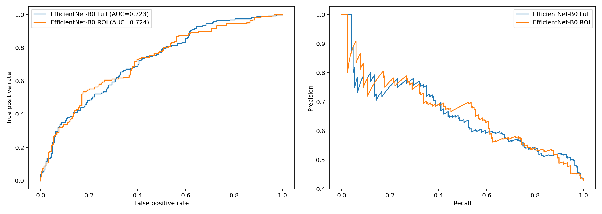

## 3.3 Kiểm soát rò rỉ và lựa chọn

WDBC giữ test ngoài toàn bộ quá trình lựa chọn; model, calibration và threshold được quyết định từ development OOF. CBIS-DDSM dùng manifest frozen và group overlap check. Kiến trúc DL và biểu diễn ảnh được lựa chọn theo validation. Test chỉ mô tả khả năng khái quát của thí nghiệm đã định trước.

<!-- PAGEBREAK -->

# 4. STUDY A - MACHINE LEARNING CỔ ĐIỂN

## 4.1 Thiết kế thực nghiệm

Ba candidate là Logistic Regression, Random Forest và XGBoost. Năm fold stratified tạo dự đoán OOF cho 455 mẫu development. Scaling nằm trong pipeline Logistic Regression để tránh fit trước cross-validation. Mỗi candidate có calibration và threshold được chọn từ OOF; sau khi khóa lựa chọn, tập test 114 mẫu mới được mô tả.

## 4.2 Kết quả lựa chọn development OOF

| Mô hình | Calibration | Ngưỡng | ROC-AUC | PR-AUC | Balanced Acc. | Brier | FN |
| --- | --- | ---: | ---: | ---: | ---: | ---: | ---: |
| Logistic Regression | Raw | 0,36 | 0,9950 | 0,9941 | 0,9724 | 0,0200 | 4 |
| Random Forest | Platt | 0,44 | 0,9876 | 0,9859 | 0,9619 | 0,0305 | 7 |
| XGBoost | Raw | 0,60 | 0,9939 | 0,9924 | 0,9712 | 0,0225 | 8 |

Logistic Regression có ROC-AUC và PR-AUC OOF cao nhất, balanced accuracy cao nhất, Brier thấp nhất và số FN thấp nhất. Đây là lý do giữ model, không phải vì model thắng trên test.

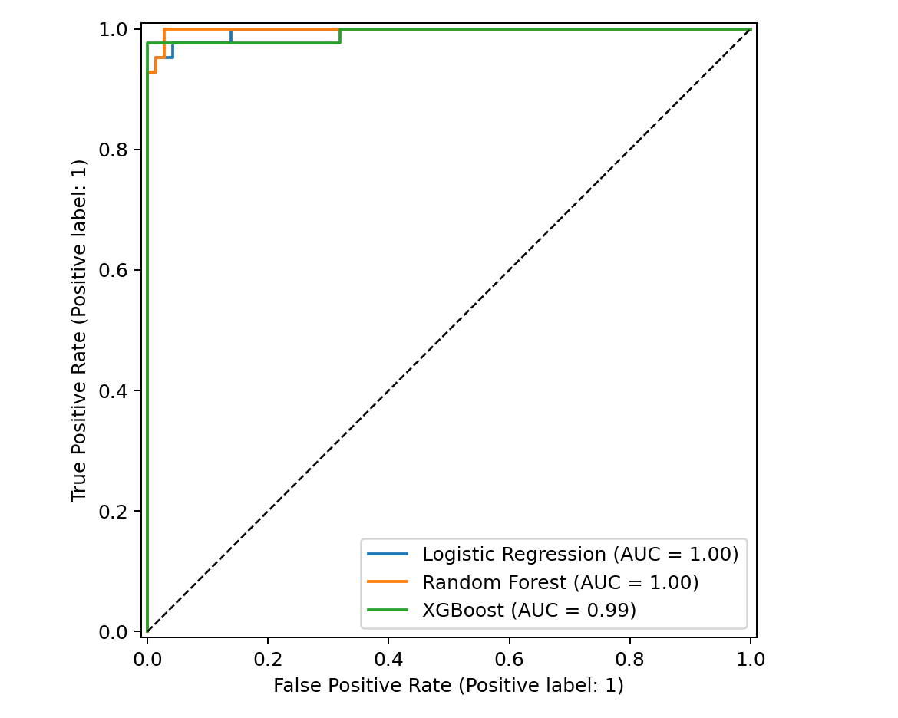

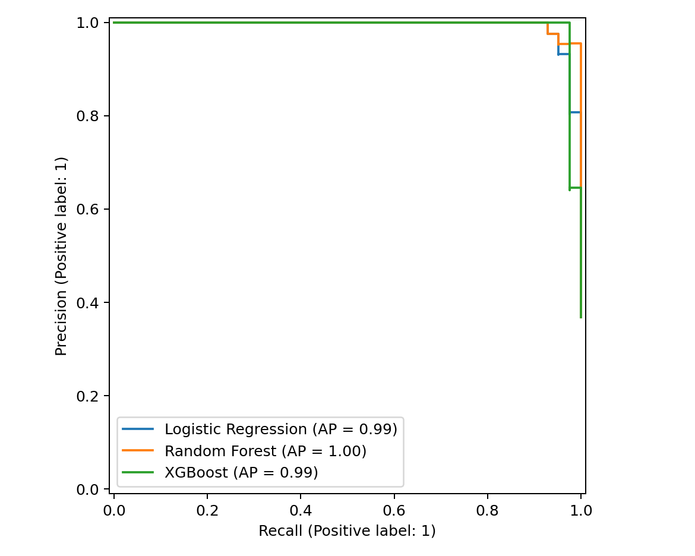

## 4.3 Mô tả held-out test

| Metric | Logistic Regression |
| --- | ---: |
| Accuracy | 0,9737 |
| Precision | 0,9756 |
| Sensitivity | 0,9524 |
| Specificity | 0,9861 |
| F1 | 0,9639 |
| Balanced Accuracy | 0,9692 |
| ROC-AUC | 0,9954 |
| PR-AUC | 0,9932 |
| Brier | 0,0222 |
| TN / FP / FN / TP | 71 / 1 / 2 / 40 |

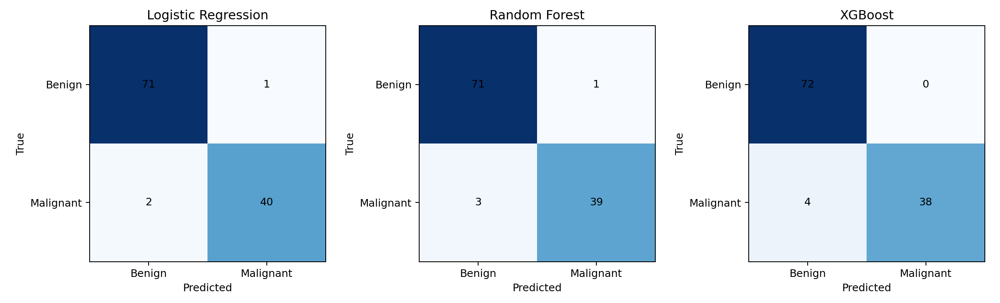

Khoảng tin cậy bootstrap 95% với 2.000 lần lặp là 0,9858-1,0000 cho ROC-AUC và 0,9299-1,0000 cho balanced accuracy. Khoảng tin cậy mô tả bất định lấy mẫu trong test hiện có, không thay thế external validation.

## 4.4 Hợp đồng runtime

Artifact là pipeline Logistic Regression kiểm tra SHA-256. Xác suất ác tính thô được so sánh với ngưỡng 0,36. Thiếu artifact hoặc checksum sai làm runtime unavailable; không fallback sang model lịch sử.

<!-- PAGEBREAK -->

# 5. STUDY B - DEEP LEARNING ẢNH NHŨ ẢNH

## 5.1 Thiết kế baseline

Custom CNN, ResNet50 và EfficientNet-B0 sử dụng cùng manifest, split nhóm, seed, label mapping, kích thước ảnh, ngân sách epoch, early stopping, checkpoint rule và bộ metrics theo cấu hình frozen tương ứng. Selection kiến trúc là validation-first. Không có architecture thứ tư hay hyperparameter sweep sau test.

## 5.2 Kết quả ba kiến trúc

| Mô hình | Sensitivity | Specificity | Balanced Acc. | ROC-AUC | PR-AUC | FN |
| --- | ---: | ---: | ---: | ---: | ---: | ---: |
| Custom CNN | 0,4583 | 0,6518 | 0,5551 | 0,6153 | 0,5207 | 91 |
| ResNet50 | 0,7202 | 0,4152 | 0,5677 | 0,6278 | 0,5844 | 47 |
| EfficientNet-B0 | 0,6786 | 0,6250 | 0,6518 | 0,7229 | 0,6564 | 54 |

EfficientNet-B0 cân bằng discrimination và operating-point trade-off tốt nhất trong ba baseline. ResNet50 có độ nhạy cao hơn nhưng độ đặc hiệu thấp hơn đáng kể và 131 FP. Custom CNN có discrimination và độ nhạy thấp hơn.

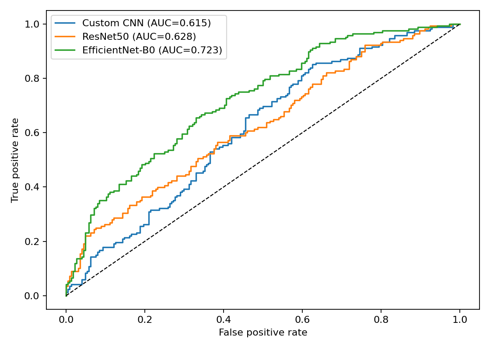

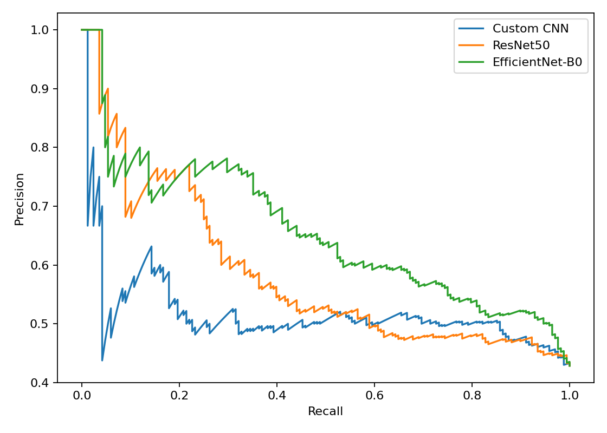

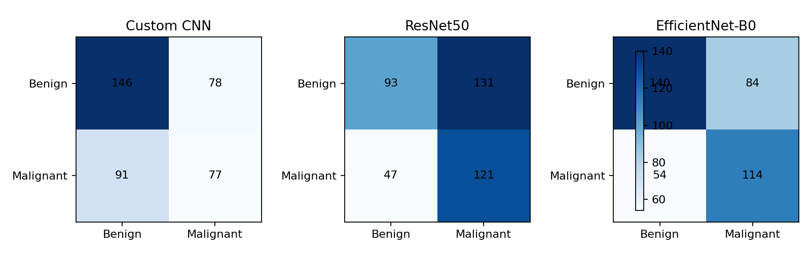

## 5.3 Ablation ảnh đầy đủ và ROI

EfficientNet-B0 được chọn cho ablation từ validation baseline. Biến độc lập là representation `images` so với `images_roi`. Trên validation, ảnh đầy đủ đạt ROC-AUC 0,7044, PR-AUC 0,6152, sensitivity 0,6813 và balanced accuracy 0,6580. ROI đạt lần lượt 0,6789, 0,6060, 0,5125 và 0,6432.

ROI tăng specificity nhưng làm giảm discrimination và sensitivity. Quyết định `ROI-C` bác bỏ ROI làm representation cuối. Việc ROI có một số metrics test thuận lợi hơn không được dùng để đảo quyết định validation-first.

## 5.4 Kết quả candidate giữ lại

EfficientNet-B0 ảnh đầy đủ đạt accuracy 0,6480, precision 0,5758, sensitivity 0,6786, specificity 0,6250, F1 0,6230, balanced accuracy 0,6518, ROC-AUC 0,7229, PR-AUC 0,6564 và Brier 0,2297. Confusion matrix gồm TN 140, FP 84, FN 54 và TP 114.

Bootstrap 95% là 0,6720-0,7722 cho ROC-AUC và 0,6024-0,7007 cho balanced accuracy. Độ phân biệt còn ở mức trung bình, nên model chỉ là research candidate.

<!-- PAGEBREAK -->

# 6. ĐỘ TIN CẬY, CALIBRATION VÀ PHÂN TÍCH SAI SỐ

## 6.1 Calibration DL

| Phương pháp | Validation Brier | Validation ECE | Test Brier | Test ECE |
| --- | ---: | ---: | ---: | ---: |
| Raw | 0,2327 | 0,1139 | 0,2297 | 0,0970 |
| Platt | 0,2118 | 0,0221 | 0,2088 | 0,0470 |
| Isotonic | 0,2175 | 0,0424 | 0,2092 | 0,0491 |

Platt được chọn vì Brier validation thấp nhất, sau đó là log loss. Ánh xạ calibration không thay đổi architecture, weights hay raw operating point.

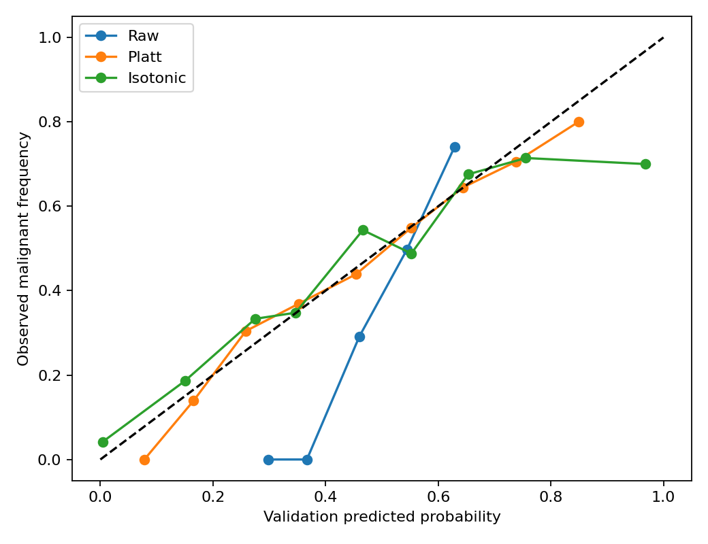

## 6.2 Hai đại lượng không được trộn lẫn

Hợp đồng phân lớp là `raw_probability >= 0.515`. Hợp đồng hiển thị là `calibrated_probability = Platt(raw_probability)`. Không áp dụng ngưỡng 0,515 lên xác suất calibrated. Giao diện trình bày hai giá trị tách biệt để tránh biến một cải thiện reliability thành thay đổi quyết định phân lớp.

## 6.3 Sai số

Logistic Regression có 2 FN và 1 FP trên held-out test. EfficientNet-B0 có 54 FN và 84 FP tại raw threshold 0,515. Các trường hợp sai được mô tả theo đầu ra model và metadata nghiên cứu; báo cáo không gán nguyên nhân bệnh lý khi không có bằng chứng chuyên gia.

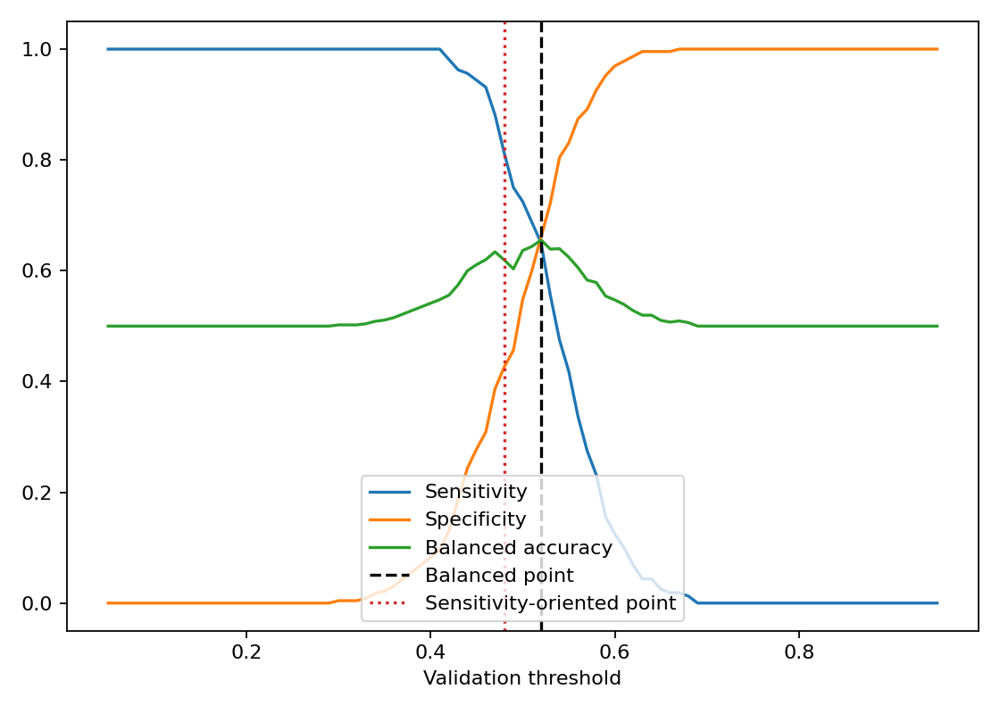

<!-- PAGEBREAK -->

# 7. KHẢ NĂNG GIẢI THÍCH

## 7.1 SHAP cho WDBC Logistic Regression

`LinearExplainer` sử dụng background chỉ từ development và giải thích output của Logistic Regression frozen. `worst texture` có mean absolute SHAP lớn nhất trong test explanation set, tiếp theo gồm `radius error`, `worst symmetry`, `compactness error` và `mean concave points`. Thứ hạng này mô tả mức đóng góp model trên tập giải thích, không phải mức quan trọng sinh học hay quan hệ nhân quả.

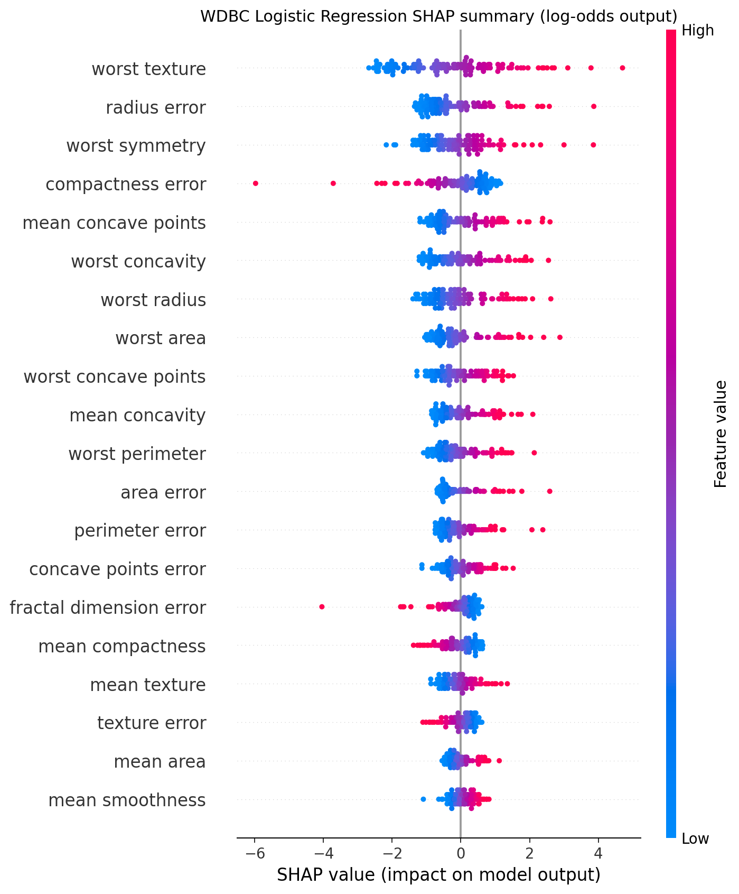

## 7.2 Grad-CAM cho EfficientNet-B0

Grad-CAM được chạy sau khi model freeze, có xác minh checksum và chọn ca TP/TN/FP/FN xác định. Layer sử dụng là `top_conv`. Hình nhiệt cho biết vùng kích hoạt thô liên quan đến output. Nó không phải lesion segmentation, lesion localization, pathology ground truth hay causal explanation.

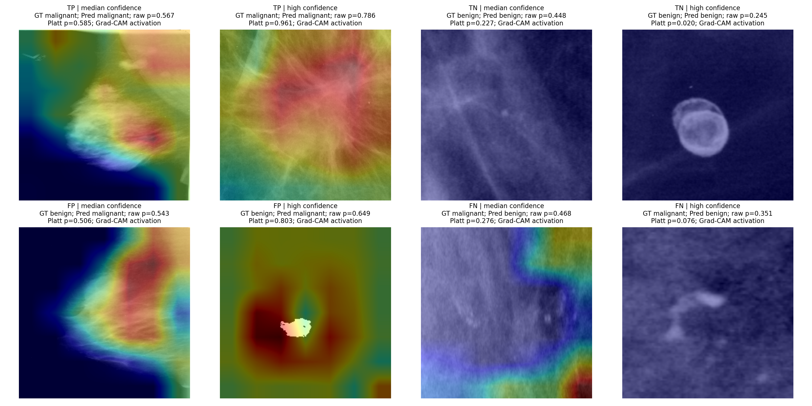

## 7.3 Giới hạn diễn giải

XAI giúp kiểm tra hành vi model, phát hiện phụ thuộc không mong muốn và hỗ trợ thảo luận lỗi. XAI không thể tự biến một model thành an toàn lâm sàng. Việc diễn giải y khoa cần đánh giá chuyên gia, thiết kế prospective và dữ liệu độc lập.

<!-- PAGEBREAK -->

# 8. NỀN TẢNG PHẦN MỀM NGHIÊN CỨU

## 8.1 Kiến trúc

Nginx phục vụ frontend tĩnh và reverse proxy cho FastAPI. Backend sử dụng SQLite cho trạng thái demo, xác thực, bệnh nhân và lịch sử. Runtime ML và DL tải artifact frozen từ mount chỉ đọc, kiểm tra SHA-256 và cung cấp metadata an toàn qua endpoint trạng thái. Platt artifact là JSON frozen có kiểm tra checksum.

Frontend Architecture V2 gồm HTML/CSS tĩnh và vanilla JavaScript ES Modules theo bốn lớp core, services, components và page controllers. Có 21 route canonical. Các bundle monolith cũ `app.js`, `styles.css` và `premium.css` đã được loại bỏ.

## 8.2 Chức năng

Các luồng gồm Landing/Auth, Dashboard, Structured ML, Mammography DL, Experimental Fusion, Research Center, Model Comparison, Dataset Explorer, Explainability, Calibration, Patients, Patient Detail, History, Reports, AI Advisor, Model Status và Profile. Dashboard và research pages đọc adapter bằng chứng trung tâm, không sao chép metrics final trong từng controller.

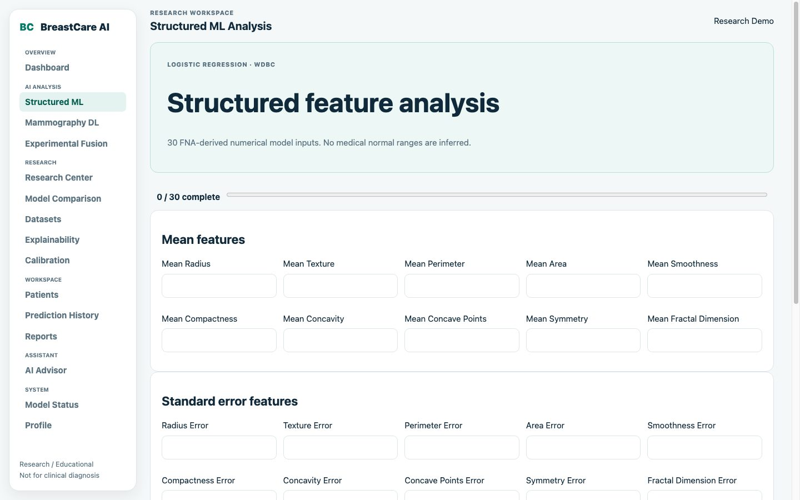

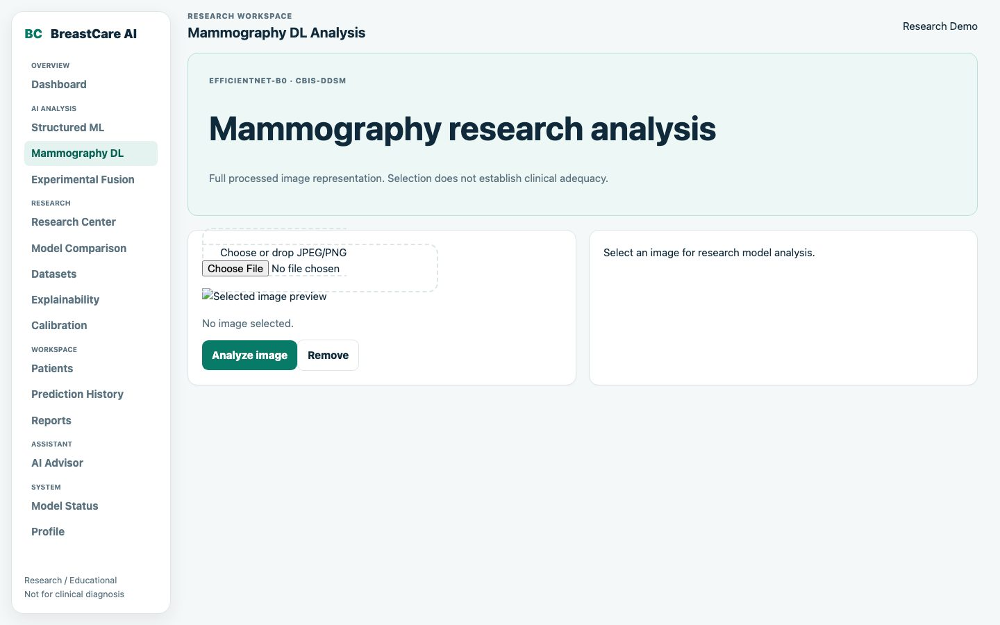

## 8.3 Kiểm thử và vận hành

QA cuối kiểm tra 21 route ở bốn viewport 1440x900, 1280x800, 768x1024 và 390x844, đạt 84/84. Workflow browser bao phủ auth, role, dự đoán, patient, history, report, advisor, status, profile và lỗi có kiểm soát. Test backend, compileall, application validator và production readiness validator đều là release gates.

Docker Compose tách dịch vụ `web` và `api`. Nginx là điểm vào công khai, API chỉ expose trong network Compose. SQLite có script backup/restore với integrity check. Model binaries và `.env` nằm ngoài Git.

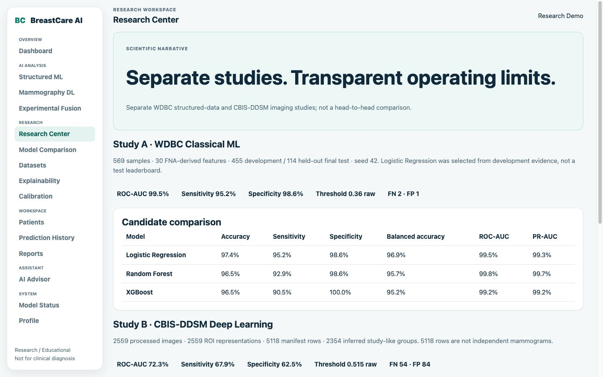

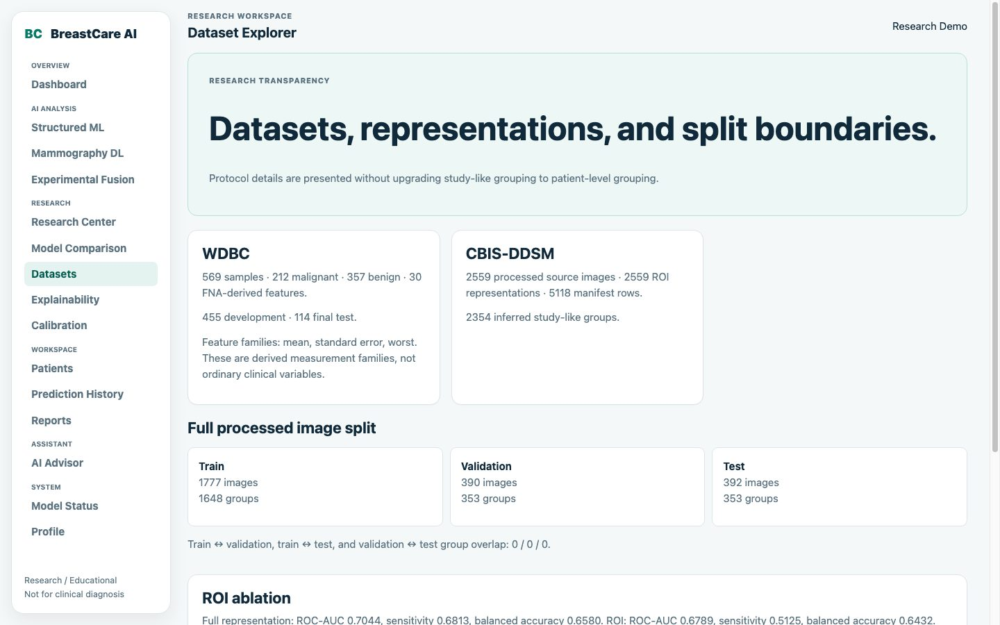

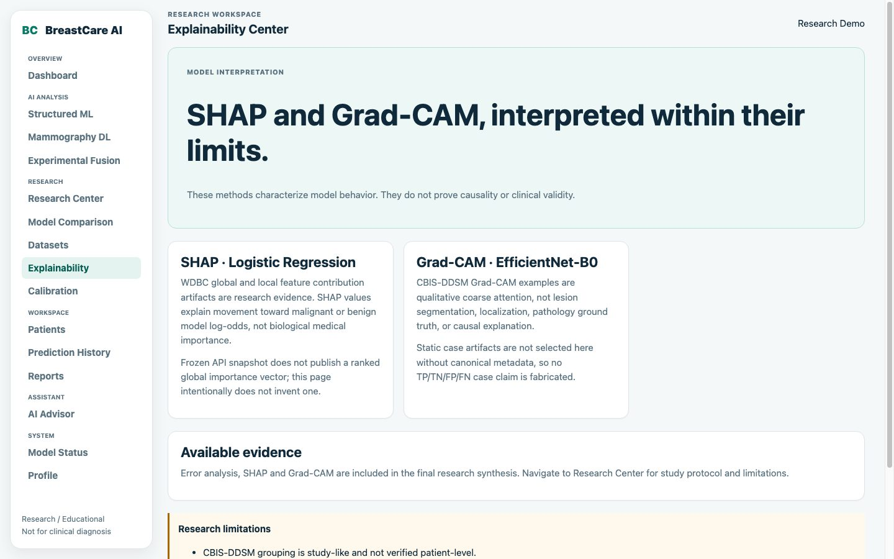

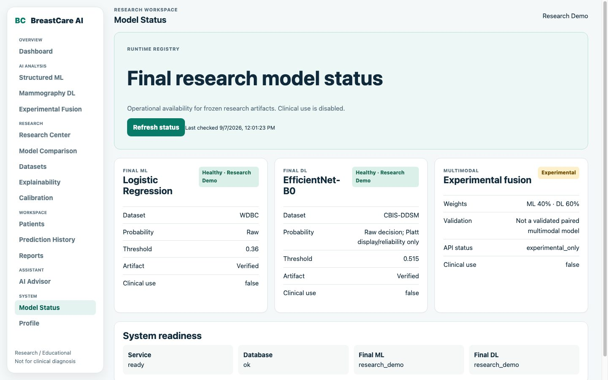

<!-- PAGEBREAK -->

# 9. MINH HỌA ĐA PHƯƠNG THỨC THỬ NGHIỆM

Phần mềm giữ một heuristic `0.4 * ML + 0.6 * DL` để minh họa tích hợp hai nguồn input. Tuy nhiên, WDBC và CBIS-DDSM không ghép cặp cùng bệnh nhân. Vì vậy không có nghiên cứu multimodal cùng bệnh nhân đã xác thực, không có final multimodal accuracy và output này không được dùng như bằng chứng khoa học.

Vai trò đúng của luồng là minh họa kỹ thuật điều phối hai runtime và giao diện, với nhãn `experimental_only`. Nghiên cứu tương lai cần một cohort ghép cặp, protocol khóa trước, missing-data policy, chiến lược fusion và test độc lập.

<!-- PAGEBREAK -->

# 10. KẾT QUẢ VÀ THẢO LUẬN

## 10.1 Trả lời câu hỏi nghiên cứu

RQ1: Logistic Regression là primary candidate trong WDBC do evidence development OOF tốt nhất theo ưu tiên ROC-AUC, PR-AUC, balanced accuracy sau threshold/calibration, Brier và FN. Test chỉ mô tả hiệu năng sau lựa chọn.

RQ2: EfficientNet-B0 ảnh đầy đủ là candidate mạnh nhất trong ba kiến trúc DL theo validation evidence và có test discrimination tốt nhất trong phạm vi thí nghiệm. ResNet50 đổi độ nhạy cao hơn lấy độ đặc hiệu thấp, còn Custom CNN yếu hơn về discrimination.

RQ3: ROI không giúp theo tiêu chí định trước. Validation ROC-AUC, PR-AUC, sensitivity và balanced accuracy đều giảm. Ảnh đầy đủ được giữ lại.

RQ4: Calibration cải thiện chất lượng xác suất hiển thị mà không thay đổi phân lớp raw. SHAP và Grad-CAM bổ sung khả năng kiểm tra model nhưng không cung cấp giải thích nhân quả.

## 10.2 Không xếp hạng ML và DL cùng nhau

ROC-AUC 0,9954 của ML và 0,7229 của DL không tạo thành một so sánh head-to-head. Hai số đến từ datasets, modalities, sample units và protocols khác nhau. Kết luận chỉ hợp lệ bên trong từng study.

## 10.3 Ý nghĩa kỹ thuật

Kết quả cho thấy tính quan trọng của development-first selection, biểu diễn rõ raw/calibrated probability, provenance giữa model và bằng chứng, cùng cơ chế fail-closed. Đối với DL, độ phân biệt trung bình và khoảng tin cậy còn rộng là tín hiệu cần external validation và protocol dữ liệu tốt hơn trước mọi thảo luận ứng dụng.

<!-- PAGEBREAK -->

# 11. HẠN CHẾ

- CBIS-DDSM grouping là inferred study-like, không phải patient-level đã xác minh.
- Không có external validation cho cả hai study.
- Snapshot CBIS-DDSM cục bộ không đại diện đầy đủ cho mọi bối cảnh chụp hoặc quần thể.
- DL có discrimination trung bình, 54 FN và 84 FP tại operating point frozen.
- WDBC có quy mô nhỏ và 30 đặc trưng FNA-derived, không phải hồ sơ lâm sàng tổng quát.
- WDBC và CBIS-DDSM không ghép cặp; fusion chỉ là demo.
- Bootstrap trên test hiện có không mô phỏng distribution shift bên ngoài.
- SHAP là post-hoc và non-causal; Grad-CAM là qualitative coarse attention.
- Chưa có đánh giá chuyên gia đọc ảnh, prospective study, subgroup fairness hoặc clinical workflow study.
- Phần mềm chưa phải thiết bị y tế, chưa có regulatory review và không dành cho chẩn đoán.

<!-- PAGEBREAK -->

# 12. HƯỚNG PHÁT TRIỂN

Ưu tiên nghiên cứu là thu thập metadata bệnh nhân/ca để xác minh patient-level split; xây dựng external cohorts; định nghĩa subgroup analysis; và tạo paired tabular-image cohort trước khi đánh giá fusion. Mọi thí nghiệm mới cần protocol và tiêu chí selection định trước, không tune bằng test hiện tại.

Ưu tiên kỹ thuật là triển khai production trên server sẵn có, cấu hình domain/DNS/HTTPS, xác minh architecture amd64/arm64, kiểm tra checksum model sau transfer, backup SQLite, smoke công khai và rollback. Server đã có nhưng production deployment chưa được thực hiện; thông tin truy cập và cấu hình vẫn chờ cung cấp.

<!-- PAGEBREAK -->

# 13. KẾT LUẬN

Đề tài hoàn thành một nền tảng nghiên cứu có thể truy vết cho hai bài toán phân loại lành tính - ác tính. Logistic Regression là primary candidate frozen trong Study A WDBC. EfficientNet-B0 ảnh đầy đủ là retained candidate frozen trong Study B CBIS-DDSM. ROI bị bác bỏ theo validation-first. Platt cải thiện reliability của xác suất DL nhưng chỉ dùng cho hiển thị; phân lớp vẫn từ raw probability và ngưỡng 0,515.

Kết quả hỗ trợ kết luận thận trọng theo từng modality, không hỗ trợ xếp hạng ML-DL xuyên dataset, không xác nhận multimodal và không chứng minh clinical utility. Giá trị của hệ thống nằm ở quy trình nghiên cứu rõ ràng, artifact frozen, kiểm tra provenance, XAI có giới hạn và phần mềm demo có cơ chế an toàn kỹ thuật.

<!-- PAGEBREAK -->

# 14. TÀI LIỆU THAM KHẢO

1. Wolberg, W., Mangasarian, O., Street, N., & Street, W. (1993). Breast Cancer Wisconsin (Diagnostic) [Dataset]. UCI Machine Learning Repository. https://doi.org/10.24432/C5DW2B.
2. Lee, R. S., Gimenez, F., Hoogi, A., Miyake, K. K., Gorovoy, M., & Rubin, D. L. (2017). A curated mammography data set for use in computer-aided detection and diagnosis research. Scientific Data, 4, 170177. https://doi.org/10.1038/sdata.2017.177.
3. He, K., Zhang, X., Ren, S., & Sun, J. (2016). Deep residual learning for image recognition. Proceedings of CVPR, 770-778.
4. Tan, M., & Le, Q. V. (2019). EfficientNet: Rethinking model scaling for convolutional neural networks. Proceedings of ICML, PMLR 97, 6105-6114.
5. Platt, J. (1999). Probabilistic outputs for support vector machines and comparisons to regularized likelihood methods. Advances in Large Margin Classifiers, 61-74.
6. Lundberg, S. M., & Lee, S.-I. (2017). A unified approach to interpreting model predictions. Advances in Neural Information Processing Systems 30.
7. Selvaraju, R. R., et al. (2017). Grad-CAM: Visual explanations from deep networks via gradient-based localization. Proceedings of ICCV, 618-626. https://doi.org/10.1109/ICCV.2017.74.
8. Pedregosa, F., et al. (2011). Scikit-learn: Machine learning in Python. Journal of Machine Learning Research, 12, 2825-2830.
9. Chen, T., & Guestrin, C. (2016). XGBoost: A scalable tree boosting system. Proceedings of KDD, 785-794.

<!-- PAGEBREAK -->

# 15. PHỤ LỤC

## Phụ lục A. Nguồn bằng chứng cuối

- `experiments/final/FINAL_RESULTS_SNAPSHOT.json`: snapshot máy đọc được.
- `paper_artifacts/MANIFEST.json`: provenance bảng và hình.
- `manifests/cbis_group_split_seed42.csv`: manifest chia nhóm frozen.
- `docs/FINAL_RESEARCH_RESULTS.md`: tổng hợp kết quả cuối.
- `docs/FINAL_RUNTIME_MODEL_CONTRACT.md`: hợp đồng runtime.

## Phụ lục B. Hợp đồng ngưỡng

| Runtime | Xác suất phân lớp | Ngưỡng | Xác suất hiển thị |
| --- | --- | ---: | --- |
| WDBC Logistic Regression | Raw malignant | 0,36 | Raw |
| CBIS EfficientNet-B0 | Raw malignant | 0,515 | Frozen Platt |

## Phụ lục C. Kiểm thử cuối

Các release gates gồm syntax check toàn bộ JavaScript modules, frontend dependency validator, 24 backend tests, compileall, final application validator, production readiness validator, Docker health/readiness, runtime SHA checks, backup/restore rehearsal và browser matrix 84/84.

## Phụ lục D. Tuyên bố an toàn

`clinical_use=false`. Mọi output là dự đoán model phục vụ nghiên cứu/giáo dục. Hệ thống không thay thế bác sĩ, bác sĩ chẩn đoán hình ảnh, giải phẫu bệnh, sinh thiết hay quy trình khám chữa bệnh.
